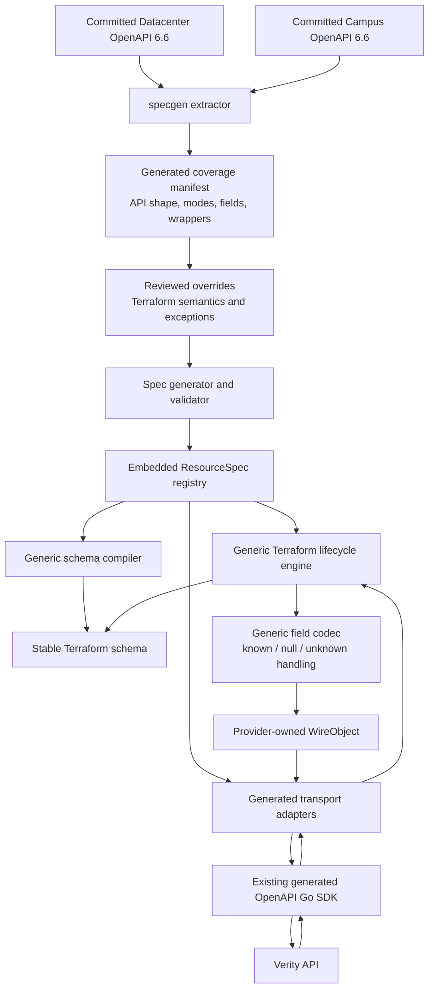
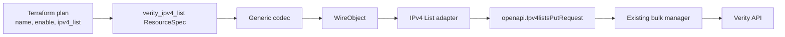

# Refactor architecture overview

## Purpose

The refactor keeps the existing generated OpenAPI Go SDK. It does not replace
the SDK; it moves the SDK behind a provider-owned boundary.

Today, each Terraform resource owns too much behavior: its Terraform schema,
API field names, generated SDK request types, bulk-operation key, response
parsing, mode rules, and null handling. The target design makes `ResourceSpec`
the provider-owned description of that behavior, while the generated OpenAPI
SDK remains responsible for HTTP communication with Verity.

## Responsibilities

- The committed OpenAPI inputs in `specs/openapi/6.6` contain reproducible API
  facts: endpoints, API field names and types, descriptions, nullability, and
  datacenter/campus availability.
- `specs/generated_manifest.json` is a conservative extraction report. It does
  not guess Terraform semantics; it marks all unresolved semantics for review.
- Reviewed overrides supply facts that OpenAPI cannot express: Terraform names,
  `Required`/`Optional`/`Computed`, replacement rules, state ownership,
  null/reset behavior, collection strategies, reference pairs, and exceptions.
- The generated `ResourceSpec` registry combines extracted API facts with
  reviewed overrides and validates them before they can drive a resource.
- The generic lifecycle engine reads Terraform Framework values, applies field
  policies, and emits a provider-owned `WireObject`.
- A generated transport adapter converts `WireObject` into a generated SDK
  request type. The IPv4 List adapter is the first validated example.
- The existing SDK continues to make HTTP requests and decode API responses. It
  no longer determines Terraform lifecycle behavior.

## IPv4 List migration path

## Migration safety

Old resources retain their handwritten lifecycle implementations and existing
SDK request path until individually migrated. A migrated resource uses the
generic path, while the bulk manager accepts both paths. This permits
resource-by-resource schema, request JSON, diagnostics, and state parity tests.

The intended end state is:

- ordinary API field additions become an input update, any necessary reviewed
  override, and regeneration;
- conventional resources are declarative specs instead of large handwritten Go
  resource implementations;
- SDK regeneration is isolated behind transport adapters; and
- unusual behavior is represented by narrow named hooks rather than bespoke
  lifecycle code for every resource.
