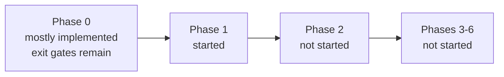

# Schema-driven refactor status

Last reviewed: 2026-09-10

This document tracks implementation against [refactor_plan.md](refactor_plan.md).
Commit state is intentionally not tracked here; use Git status and history for
that information. Existing unrelated `.gitignore` and planning-file changes are
not treated as refactor deliverables.

## Current position

Phase 0 is substantially implemented but its exit criterion is **not yet met**.
Phase 1 has started: the spec model, validation, and conservative OpenAPI
extraction report exist, but overrides and the complete generated registry do
not. No production resource has moved to the generic lifecycle engine, so
Phase 2 has not started.

## Phase 0: characterize and freeze behavior

| Plan item | Status | Evidence / remaining work |
| --- | --- | --- |
| Commit reproducible 6.6 mode-specific inputs | Implemented, pending commit | `specs/openapi/6.6/{datacenter,campus,manifest}.json`; `specgen verify` checks canonical format and SHA-256 checksums. |
| Offline CI verification | Implemented, pending commit | CI runs `specgen verify` and deterministic extraction check. |
| Schema snapshot of current resources | Implemented, pending commit | `tests/unit/testdata/schema_snapshot_v6_6.json` captures 51 registered resource schema versions, state types, flags, and deterministic modifier/validator parameters. |
| Request/response golden fixtures for every resource | Not started | Needed before generic lifecycle migration. |
| Read and PATCH field-coverage expansion | Not started | Existing tests remain useful, but registry-driven coverage is not implemented. |
| Full exception inventory | Not started | Legacy exceptions still need classification into policy, strategy, dependency, or hook. |
| API range and lifecycle-policy design | Implemented | `internal/spec` defines numeric API ranges, deterministic literals, and all five lifecycle policies. |
| Framework generic value bridge spike | Implemented, pending commit | Protocol-level `value_bridge_test.go` proves recursive generic Framework reads/writes, including null and unknown values. |
| IPv4 List transport adapter spike | Implemented, pending commit | `internal/transport` exact JSON tests plus bulk-manager integration cover omission, false/empty values, explicit-null errors, and no-panic diagnostics. |
| Version-zero state contract and upgrade mechanism | Implemented, pending commit | Snapshot captures current state types; `internal/genericresource/state.go` registers prior schemas/upgraders and has a real Framework v0-to-v1 test. |
| Stable provider registration | Implemented, pending commit | `Resources()` is mode-independent; contract test verifies names/order/state types before configuration and in both modes. |
| Final nullable/reset policy decision | Partially implemented | Policies are represented and validated in `FieldSpec`; provider-wide behavioral mapping and legacy parity fixtures remain. |

### Phase 0 exit blockers

1. Add per-resource request/response golden fixtures and registry-driven Read/PATCH coverage.
2. Complete and review the legacy exception inventory.
3. Map nullable/reset behavior from every legacy resource into explicit policy values.
4. Commit the completed Phase 0 foundation after review.

## Phase 1: introduce and validate the spec registry

| Plan item | Status | Evidence / remaining work |
| --- | --- | --- |
| `ResourceSpec` / `FieldSpec` types and strict validation | Implemented, pending commit | `internal/spec/model.go`, `validate.go`, and tests validate modes, ranges, literal types, ownership, policies, links, and collection strategies. |
| First build-selected registry seed | Implemented, pending commit | `internal/spec/registry_seed.go` holds the reviewed `verity_ipv4_list` 6.6 datacenter-only seed. It is deliberately not a complete registry. |
| OpenAPI extraction | Implemented, pending commit | `specgen extract` reads both canonical inputs and produces `specs/generated_manifest.json`. It reports 64 mutable endpoint candidates with GET/PUT/PATCH/DELETE availability, request wrappers, documented response collection keys, delete query-parameter shapes, fields, mode presence, and review-required items. Missing API response schemas and cache keys remain explicit override requirements. |
| Override format and merge | Not started | Required to convert API facts into complete Terraform/resource behavior without guesses. |
| Generate current metadata without lifecycle changes | Not started | Compatibility, API aliases, transport registry, and constructor metadata still come from legacy code/maps. |
| `specgen --check` in CI | Partially implemented | CI checks canonical inputs and `extract --check`; it does not yet generate/check the complete `ResourceSpec` registry. |
| Report unresolved/ambiguous API fields | Implemented at API-shape level | Generated manifest marks fields and resources requiring policy/alias/strategy review. It does not yet compare every field against legacy implementations. |
| Validate every legacy resource and field against ranges/policies | Not started | Requires overrides plus full registry generation. |

### Phase 1 exit blockers

1. Define the reviewed override schema and validate override targets against extracted API facts.
2. Build deterministic override merge and generated complete registry.
3. Map every existing Terraform resource, field path, API alias, operation, mode, version, policy, and nested strategy.
4. Generate compatibility, bulk, importer, and constructor metadata from that registry while retaining old lifecycle implementations.
5. Add full registry `--check` and legacy parity/coverage checks to CI.

## SDK reproducibility baseline

`tools/generate_openapi_sdk.sh` now transforms only the committed 6.6 inputs
and invokes OpenAPI Generator 7.25.0 by immutable Docker digest in a temporary
directory. Its `--check` mode currently reports drift against the tracked
`openapi/` directory. This is expected to remain a **blocking baseline
reconciliation task**: the SDK must be regenerated, its large diff reviewed,
and provider compilation/parity revalidated before the SDK check is enabled as
a required CI step. The script does not modify `openapi/` unless `--write` is
explicitly requested.

## Later phases

| Phase | Status | Start condition |
| --- | --- | --- |
| Phase 2: generic scalar lifecycle pilot | Not started | Phase 0 and Phase 1 exit criteria must pass. The intended first pilot is `verity_ipv4_list`. |
| Phase 3: shared semantic policies | Not started | Begins after scalar pilot parity; Badge follows nullable/reset and singleton-policy contracts. |
| Phase 4: indexed collections | Not started | Begins after shared field policies are stable. |
| Phase 5: complex/exceptional resources | Not started | Begins after collection strategies are proven. |
| Phase 6: remove legacy duplication | Not started | Begins only after all API-backed resources use the generic engine. |

## Completed implementation artifacts

- `specs/openapi/6.6/`: committed-style, checksummed canonical API inputs.
- `tools/specgen/`: canonicalization, verification, and deterministic API-shape extraction.
- `specs/generated_manifest.json`: extracted 6.6 coverage report.
- `internal/spec/`: provider-owned spec vocabulary, registry validation, and IPv4 List seed.
- `internal/transport/`: provider-owned wire values and initial IPv4 List SDK adapter.
- `internal/genericresource/state.go`: reusable state-upgrader registration contract.
- `tests/unit/lifecycle/`: version-zero schema snapshot and Framework value-bridge contract tests.
- `internal/bulkops/`: error-aware adapter integration that preserves the legacy typed path.

## Recommended next slice

Define `specs/overrides.*` as a small, validated reviewed-data format, beginning
with `verity_ipv4_list`. Then implement deterministic override merge into a
generated registry artifact and compare that result with the existing resource
schema and transport aliases. This advances Phase 1 without migrating any
production lifecycle yet.
