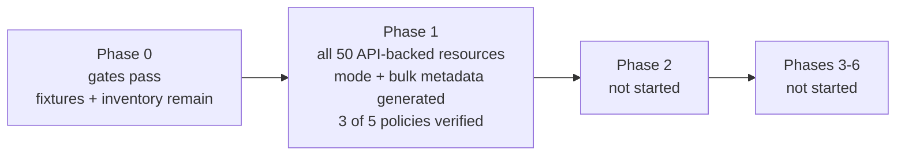

# Schema-driven refactor status

Last reviewed: 2026-09-11

This document tracks implementation against [refactor_plan.md](refactor_plan.md).
Commit state is intentionally not tracked here; use Git status and history for
that information. Existing unrelated `.gitignore` and planning-file changes are
not treated as refactor deliverables.

## Current position

All six pre-migration gates from the plan's executive recommendation pass.

A deterministic registry now covers **all 50 API-backed Terraform resources**
across 49 endpoints, and every one is checked field by field against the schema
the provider actually ships. The 51st, `verity_operation_stage`, is not
API-backed; the plan keeps it bespoke (lines 402, 571, 573), so it is excluded by
design rather than missing.

The registry also drives the provider: mode compatibility and bulk transport
metadata are generated from it, each pinned to a frozen snapshot of the values
that shipped. No production resource has moved to the generic lifecycle engine,
so Phase 2 has not started.

### Coverage snapshot

| Measure | Count |
| --- | --- |
| Registry resources | 50 of 50 API-backed |
| Endpoints represented | 49 of 64 |
| Field paths represented | 1068 (1063 managed) |
| Nested collection strategies in use | 54 `indexed_patch`, 27 `singleton` |
| API fields recorded as unmanaged | 5 |
| Reviewed override file | 3,337 lines |

Every Terraform resource the provider registers is now represented, so the
earlier blocked list is empty. Resolving it needed three things: representing an
API object the document declares with no properties (Device Settings, SFP
Breakout ship it as an empty block), recursing into blocks nested inside blocks
(Fabric's `object_properties.system_graphs`), and recording that the API itself
documents `verity_gateway.fabric_interconnect` with an empty description.

The remaining 15 unrepresented endpoints back no Terraform resource. Five fail a
spec rule (`/alarms/mask`, `/readmode`, and three PATCH-only endpoints); the rest
are aggregate or action endpoints such as `/config` and `/backups` that need a
deliberate decision about whether they should be resources at all.



## Phase 0: characterize and freeze behavior

| Plan item | Status | Evidence / remaining work |
| --- | --- | --- |
| Commit reproducible 6.6 mode-specific inputs | Implemented | `specs/openapi/6.6/{datacenter,campus,manifest}.json`; `specgen verify` checks canonical format and SHA-256 checksums. |
| Offline CI verification | Implemented | CI runs `specgen verify` and deterministic extraction check. |
| Schema snapshot of current resources | Implemented | `tests/unit/testdata/schema_snapshot_v6_6.json` captures 51 registered resource schema versions, state types, flags, and deterministic modifier/validator parameters. |
| Request/response golden fixtures for every resource | Not started | Needed before generic lifecycle migration. |
| Read and PATCH field-coverage expansion | Not started | Existing tests remain useful, but registry-driven coverage is not implemented. |
| Full exception inventory | Started | The first classified exception is resolved: ACL v4/v6 are two resources on one endpoint, now expressed with `fixed_headers` pinning `ip_version` and validated against the legacy `HeaderSplitKey`. Two further exceptions are now represented: an API object declared with no properties, which Device Settings and SFP Breakout ship as an empty block, and a field the API itself documents with an empty description, recorded with `undocumented: true`. `reviewedModes` still restates rather than overrides, erroring unless declared modes equal extracted modes, so any mode-extraction defect will need an escape hatch carrying a recorded justification. Remaining legacy exceptions still need classification. |
| API range and lifecycle-policy design | Implemented | `internal/spec` defines numeric API ranges, deterministic literals, and all five lifecycle policies. |
| Framework generic value bridge spike | Implemented | Protocol-level `value_bridge_test.go` proves recursive generic Framework reads/writes, including null and unknown values. |
| IPv4 List transport adapter spike | Implemented | `internal/transport` exact JSON tests plus bulk-manager integration cover omission, false/empty values, explicit-null errors, and no-panic diagnostics. |
| Version-zero state contract and upgrade mechanism | Implemented | Snapshot captures current state types; `internal/genericresource/state.go` registers prior schemas/upgraders and has a real Framework v0-to-v1 test. |
| Stable provider registration | Implemented | `Resources()` is mode-independent; contract test verifies names/order/state types before configuration and in both modes. |
| Final nullable/reset policy decision | Partially implemented | Policies are represented and validated in `FieldSpec`; provider-wide behavioral mapping and legacy parity fixtures remain. |

### Phase 0 exit blockers

1. Add per-resource request/response golden fixtures and registry-driven Read/PATCH coverage.
2. Complete and review the legacy exception inventory.
3. Map nullable/reset behavior from every legacy resource into explicit policy values.
4. Commit the completed Phase 0 foundation after review.

### Descriptions follow the API

Field descriptions are taken from `specs/openapi/6.6/{datacenter,campus}.json`. 248
legacy descriptions that had drifted from the API text were aligned to it across
36 resources, so an API documentation improvement now reaches the provider by
regenerating rather than by hand-editing Go schemas.

An override remains in only three cases, all of which the API cannot supply:

| Case | Count |
| --- | --- |
| Resource-level descriptions, which OpenAPI does not carry per endpoint | 46 |
| Fields the API documents with no description at all | 71 |
| ACL v4/v6, where one endpoint backs two resources and OpenAPI can only say "IPv4" | 10 |

## Phase 1: introduce and validate the spec registry

| Plan item | Status | Evidence / remaining work |
| --- | --- | --- |
| `ResourceSpec` / `FieldSpec` types and strict validation | Implemented | `internal/spec/model.go`, `validate.go`, and tests validate modes, ranges, literal types, ownership, policies, links, and collection strategies. |
| First generated registry artifact | Implemented | `specs/overrides.yaml` is the reviewed source and `specs/generated_registry.json` is its deterministic merged output. No handwritten resource seed remains. |
| OpenAPI extraction | Implemented | `specgen extract` reads both canonical inputs and produces `specs/generated_manifest.json`. It reports 64 mutable endpoint candidates with GET/PUT/PATCH/DELETE availability, request wrappers, documented response collection keys, delete query-parameter shapes, recursive fields, array item types, mode presence, and review-required items. Missing API response schemas and cache keys remain explicit override requirements. |
| Override format and merge | Implemented for scalar, singleton-object, nested, and scalar-list shapes | The format supports recursive fields, collection strategies, reference/auto-assignment companions, scalar-list element kinds, per-field modes and API-version ranges, unmanaged API fields, and several Terraform resources on one endpoint discriminated by `fixed_headers`. `specgen registry` resolves the declared defaults and validates target paths, field and item types, modes, documented wrapper aliases, delete-parameter requiredness, and every lifecycle policy before emitting the expanded registry. Undocumented response aliases remain reviewed override data, covered by legacy parity. |
| Generate current mode/version, compatibility, JSON key, bulk adapter, and constructor metadata | Mostly implemented | `specgen metadata` generates `internal/utils/generated_mode_metadata.go` and `internal/bulkops/generated_bulk_metadata.go`. Mode compatibility is fully generated: `pendingModeFields` is empty and only the non-API `verity_operation_stage` remains hand-maintained. The bulk registry no longer writes its own resource type or the ACL header split key; both are filled from the registry at init and fail loudly if a bulk key is unknown. Both are pinned to frozen snapshots. Still legacy: per-resource JSON keys, which live as constants in each resource file, and constructor registration in `getAllResources`. |
| `specgen --check` in CI | Implemented for current registry scope | CI checks canonical inputs, extraction, and generated-registry drift. |
| Report unresolved/ambiguous API fields | Implemented | The manifest marks fields and resources requiring policy, alias, or strategy review, and the merge refuses any extracted field without an explicit override. Legacy comparison covers all 50 represented resources; see Legacy parity coverage. |
| Validate every current resource and field against ranges/policies | Mostly implemented | All 50 API-backed resources and 1,068 field paths validate against API-version ranges and modes; the 1,063 managed paths also carry complete lifecycle policies, and each is checked against the shipped Terraform schema. `update_clear`, `create_null`, and `response_absence` are verified against legacy behavior across all 50 resources (1,520 assertions, 213 fields excluded by named category); `unknown_plan`, `state_ownership`, and all nested paths are not. |

### Generated provider metadata

`specgen metadata` emits two files, both drift-checked in CI:

| File | Supplies | Hand-maintained remainder |
| --- | --- | --- |
| `internal/utils/generated_mode_metadata.go` | `ResourceCompatibility`, `ModeFields` | `verity_operation_stage` only, which is not API-backed |
| `internal/bulkops/generated_bulk_metadata.go` | bulk resource types, ACL header split key | none |

Both changes had to alter nothing observable, so each is pinned to a frozen
snapshot of the values that shipped: `internal/utils/testdata/mode_metadata_snapshot.json`
covers 51 compatibility entries and 1054 field entries, and
`internal/bulkops/testdata/bulk_metadata_snapshot.json` covers 49 bulk keys. Mode
data decides which fields reach a datacenter or campus system, and the resource
type keys every bulk operation's status tracking, so neither could be allowed to
drift while its source moved.

The bulk registry previously repeated its own map key in all 49 entries and
carried the ACL split key as a literal. Both are now filled at init from the
registry, and an unknown bulk key panics rather than running with an empty
resource type.

This also replaces `tools/compare_schemas.py` as the source of
`internal/utils/schema.go`, removing the second, independently maintained
definition of mode data that the plan identifies as a duplication risk.

### Legacy parity coverage

`TestGeneratedSpecsMatchLegacySchemas`, `TestGeneratedSpecsMatchLegacyBulkRegistry`,
and `TestGeneratedPoliciesMatchLegacyBehavior` run over every resource in the
generated registry and fail if the mapping tables do not cover it, so a new
override cannot be added without parity coverage.

Asserted against legacy code today:

- Terraform type name, from the resource's own `Metadata`.
- Resource modes against `utils.ResourceCompatibility`. This is the only check
  tying mode extraction from datacenter/campus OpenAPI presence to shipped behavior.
- Cache key against the resource's own constant or accessor, and bulk key against `bulkops.resourceRegistry`.
- Fixed headers against the legacy `HeaderSplitKey`, so a discriminator cannot drift from the key the bulk manager splits batches on.
- Top-level attribute plus block count against generated field count, in both
  directions, so a legacy attribute missing from the registry fails.
- Per field: kind, description, sensitivity, required/optional/computed, and RequiresReplace.
- Nested blocks: description and nested attribute count, then each nested field as above.
- Nested blocks inside blocks, recursively, which Fabric needs for
  `object_properties.system_graphs`.
- Constructors are taken from the provider's own registration list, so a generated
  resource with no shipped counterpart fails rather than being skipped.
- `update_clear`, `create_null`, and `response_absence` against the create, update,
  and read helpers each resource actually calls.

Lifecycle policies are now partly verified against the legacy implementation
rather than assumed. Three of the five are checked: 1,520 assertions, with no
disagreements. Coverage is exact rather than best-effort — every registry
resource must appear in the evidence and every field must either carry evidence
or fall into a named excluded category, so a resource cannot lose verification
silently.

### Lifecycle policies are verified against legacy behavior

The registry originally assigned one profile to every managed field. Comparing
that against what the resources actually do found three separate errors:

| Policy | What the registry claimed | What legacy does | Fields wrong |
| --- | --- | --- | --- |
| `update_clear` | always `api_null` | `""`, `false`, or `0` unless the field uses a nullable helper | 282 |
| `create_null` | always `omit` | explicit null for nullable fields | 120 |
| `response_absence` | `error` for identity fields | every read helper returns Terraform null | 48 |

None of these are visible in the Terraform schema, so the schema parity harness
could not have caught them. Nothing consumed the policies yet, so no behavior was
affected; the generic engine would have been the first consumer.

`update_clear` and `create_null` are now derived from the same wire capability:
only a nullable field can carry an explicit null, so everything else is omitted on
create and cleared to its zero value on update.

Nullability itself follows the API's design rule rather than the committed
documents. Only numerics are nullable, and `tools/process_swagger.py` applies that
to the SDK input by marking every number and integer nullable except one named
`index`, which identifies a collection entry and must always be present. The
committed documents are the raw export and predate that transform, so reading
their flag directly needed 26 per-field exceptions; applying the rule needs none
and agrees with the legacy implementation on all 490 evidenced non-identity
fields. It also settles the 54 nested `index` fields, which the raw flag left
ambiguous. The plan notes the same transform at line 238.

`response_absence` for identity fields was changed from `error` to
`terraform_null` to match the read helpers. Whether a missing identity should
instead be a hard diagnostic is a real question, but it belongs to the open
nullable/reset decision rather than to an assumption baked into the registry.

`TestGeneratedPoliciesMatchLegacyBehavior` pins all three against
`internal/provider/testdata/legacy_field_policies.json`.

213 top-level fields are excluded from policy verification by category, each for
a stated reason: 80 objects and arrays, which their collection strategy clears
rather than a wire value, and the 133 halves of reference and auto-assignment
pairs, which each resource drives with bespoke logic instead of the shared
helpers. The 310 nested field paths are not covered by this evidence either.

Those pairs are a gap in their own right. `FieldSpec` has `Reference` and
`AutoAssignment`, and the plan lists paired `*_ref_type_` and `*_auto_assigned_`
behavior among the things a plain schema cannot express, but no override
populates either yet. The pairs are currently recognised only by their naming
convention.

Still unverified: `unknown_plan` and `state_ownership` on every field, all five
policies on the 310 nested field paths, and the reference and auto-assignment
pairs above.

Not yet asserted against legacy code: validators, defaults, plan modifiers other
than RequiresReplace, request/response payload shapes, delete parameters, and
request wrapper keys. Those are validated against OpenAPI extraction instead,
which for delete parameters now includes a requiredness check rather than a bare
name match.

### Phase 1 exit criterion

The plan requires "one generated registry accounts for every existing resource,
field path, alias, operation, mode, version, lifecycle policy, and nested
strategy while old resources still run, and every pre-migration gate in the
executive recommendation passes."

Registry coverage today: all 50 API-backed resources, 1,068 field paths (1,063
managed and 5 explicitly unmanaged), 49 of 64 endpoints, and two nested collection
strategies in use (54 `indexed_patch`, 27 `singleton`). Old resources still run
untouched. The resource, field path, alias, operation, mode, version, and nested
strategy halves of the criterion are met. Two things remain:

1. **Lifecycle policies are only partly verified.** Three of five are checked
   against legacy behavior across all 50 resources, 1,520 assertions; the other
   two, the 310 nested field paths, and the 213 fields excluded by category are
   not.
2. **Two metadata consumers remain legacy-owned.** Mode compatibility and bulk
   transport metadata are generated; per-resource JSON keys and constructor
   registration are not.

### Pre-migration gates

Phase 2 may not begin until all six gates from the plan's executive
recommendation pass. They do:

| Gate | Status | Evidence |
| --- | --- | --- |
| 1. Versioned, mode-specific OpenAPI inputs committed and reproducible | Pass | `specs/openapi/6.6/` with checksum manifest; `specgen verify` in CI |
| 2. API-version applicability and full field lifecycle policies represented and validated | Pass | `internal/spec/validate.go`; all 1,068 field paths carry validated kinds, modes, and version ranges, and the 1,063 managed ones carry complete lifecycle policies. The 5 unmanaged fields deliberately carry none, since Terraform does not surface them. |
| 3. Framework spike proves generic plan/config reads and state writes without losing null or unknown | Pass | `tests/unit/lifecycle/value_bridge_test.go` |
| 4. Generated transport adapter proves exact wire JSON across the typed OpenAPI/bulk boundary | Pass | `internal/transport/ipv4_list_test.go` |
| 5. Resource registration fixed before configuration and mode-independent | Pass | `TestResourcesAreModeIndependentAndStable` |
| 6. Version-zero state contract and upgrader mechanism tested | Pass | `internal/genericresource/state_test.go` |

The gates are not the constraint. The two Phase 1 items above are, together with
the Phase 0 blockers listed earlier: golden fixtures, Read/PATCH coverage, and
the exception inventory.

## SDK reproducibility baseline

`tools/generate_openapi_sdk.sh` now transforms only the committed 6.6 inputs
and invokes OpenAPI Generator 7.25.0 by immutable Docker digest in a temporary
directory. Its `--check` mode currently reports drift against the tracked
`openapi/` directory. This is expected to remain a **blocking baseline
reconciliation task**: the SDK must be regenerated, its large diff reviewed,
and provider compilation/parity revalidated before the SDK check is enabled as
a required CI step. The script does not modify `openapi/` unless `--write` is
explicitly requested.

## Later phases

| Phase | Status | Start condition |
| --- | --- | --- |
| Phase 2: generic scalar lifecycle pilot | Not started | Phase 0 and Phase 1 exit criteria must pass. The intended first pilot is `verity_ipv4_list`. |
| Phase 3: shared semantic policies | Not started | Begins after scalar pilot parity; Badge follows nullable/reset and singleton-policy contracts. |
| Phase 4: indexed collections | Not started | Begins after shared field policies are stable. |
| Phase 5: complex/exceptional resources | Not started | Begins after collection strategies are proven. |
| Phase 6: remove legacy duplication | Not started | Begins only after all API-backed resources use the generic engine. |

## Completed implementation artifacts

- `specs/openapi/6.6/`: committed-style, checksummed canonical API inputs.
- `tools/specgen/`: canonicalization, verification, deterministic API-shape extraction, registry generation, and provider metadata generation.
- `specs/generated_manifest.json`: extracted 6.6 coverage report.
- `specs/overrides.yaml`: reviewed non-OpenAPI behavior, stated as deviations from named defaults.
- `specs/generated_registry.json`: deterministic merged registry plus explicit unrepresented-resource report.
- `internal/spec/`: provider-owned spec vocabulary and registry validation.
- `internal/transport/`: provider-owned wire values and initial IPv4 List SDK adapter.
- `internal/genericresource/state.go`: reusable state-upgrader registration contract.
- `tests/unit/lifecycle/`: version-zero schema snapshot and Framework value-bridge contract tests.
- `internal/bulkops/`: error-aware adapter integration that preserves the legacy typed path.
- `internal/utils/generated_mode_metadata.go`: generated mode compatibility, with a frozen snapshot pinning it to the values that shipped.
- `internal/bulkops/generated_bulk_metadata.go`: generated bulk transport facts, likewise snapshot-pinned.
- `internal/provider/testdata/legacy_field_policies.json`: recorded legacy create, update, and read behavior per field, the evidence behind the verified lifecycle policies.
- `internal/provider/legacy_schema_dump_test.go`: authoring aid that dumps the shipped schemas; inert unless `DUMP_OUT` is set.

## How to verify this status

```bash
go vet ./...
go run ./tools/specgen verify   --input-dir specs/openapi/6.6
go run ./tools/specgen extract  --input-dir specs/openapi/6.6 --output specs/generated_manifest.json --check
go run ./tools/specgen registry --input-dir specs/openapi/6.6 --overrides specs/overrides.yaml \
                                --output specs/generated_registry.json --check
go run ./tools/specgen metadata --registry specs/generated_registry.json \
                                --output internal/utils/generated_mode_metadata.go \
                                --bulk-output internal/bulkops/generated_bulk_metadata.go --check
go test ./... -count=1
```

The full suite runs in roughly one minute with the delay variables the CI
workflow sets; without them the lifecycle package alone takes far longer.
`internal/bulkops/types.go` fails `gofmt` at HEAD, predating this work.

## Recommended next slice

1. Extend policy verification to the 310 nested field paths and the 133 reference
   and auto-assignment pairs, then to `unknown_plan` and `state_ownership`. Of the
   three policies checked so far, all three were wrong, so the remaining two
   deserve the same treatment rather than the benefit of the doubt. Modelling the
   pairs in `FieldSpec.Reference` and `FieldSpec.AutoAssignment` is a prerequisite,
   since they are currently recognised only by naming convention.
2. Generate the remaining metadata: per-resource JSON keys, which live as
   constants in each resource file, and constructor registration.

Phase 0 also still needs request/response golden fixtures, registry-driven
Read/PATCH coverage, and the exception inventory completed.

Keep reviewed overrides as the only editable resource metadata and generated
registry output as the parity target.
