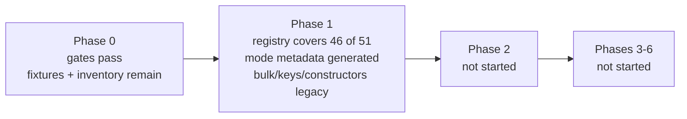

# Schema-driven refactor status

Last reviewed: 2026-09-11

This document tracks implementation against [refactor_plan.md](refactor_plan.md).
Commit state is intentionally not tracked here; use Git status and history for
that information. Existing unrelated `.gitignore` and planning-file changes are
not treated as refactor deliverables.

## Current position

All six pre-migration gates from the plan's executive recommendation pass.

A deterministic registry now covers **46 of the 51 registered Terraform
resources** across 45 endpoints, and every one is checked field by field against
the schema the provider actually ships. Phase 0's remaining work is test
coverage rather than design.

Phase 1's last bullet has started: **the registry now drives the provider's mode
compatibility.** `utils.ResourceCompatibility` and `utils.ModeFields` are derived
from it, pinned to a frozen snapshot of their previous values. Bulk adapter, JSON
key, and constructor metadata still come from legacy maps. No production resource
has moved to the generic lifecycle engine, so Phase 2 has not started.

### Coverage snapshot

| Measure | Count |
| --- | --- |
| Registry resources | 46 of 51 registered |
| Field paths represented | 901 (284 nested, 896 managed) |
| Endpoints represented | 45 of 64 |
| Nested collection strategies in use | 47 `indexed_patch`, 24 `singleton` |
| API fields recorded as unmanaged | 5 |
| Reviewed override file | 2,836 lines |

The five unrepresented Terraform resources are each blocked by a specific,
recorded reason rather than by missing format support:

| Resource | Reason |
| --- | --- |
| `verity_gateway` | Legacy `fabric_interconnect` has an empty description, and OpenAPI supplies none. A description is required, so this needs a reviewed wording decision rather than a generated one. |
| `verity_device_settings`, `verity_sfp_breakout` | OpenAPI declares `object_properties` with no properties, yet both resources expose the block. The API shape and the shipped schema disagree. |
| `verity_fabric` | Legacy omits `object_properties.system_graphs`, which OpenAPI declares. |
| `verity_operation_stage` | Not API-backed; it has no endpoint. |

The remaining 19 unrepresented endpoints back no Terraform resource. Five fail a
spec rule (`/alarms/mask`, `/readmode`, and three PATCH-only endpoints); the rest
are aggregate or action endpoints such as `/config` and `/backups` that need a
deliberate decision about whether they should be resources at all.



## Phase 0: characterize and freeze behavior

| Plan item | Status | Evidence / remaining work |
| --- | --- | --- |
| Commit reproducible 6.6 mode-specific inputs | Implemented | `specs/openapi/6.6/{datacenter,campus,manifest}.json`; `specgen verify` checks canonical format and SHA-256 checksums. |
| Offline CI verification | Implemented | CI runs `specgen verify` and deterministic extraction check. |
| Schema snapshot of current resources | Implemented | `tests/unit/testdata/schema_snapshot_v6_6.json` captures 51 registered resource schema versions, state types, flags, and deterministic modifier/validator parameters. |
| Request/response golden fixtures for every resource | Not started | Needed before generic lifecycle migration. |
| Read and PATCH field-coverage expansion | Not started | Existing tests remain useful, but registry-driven coverage is not implemented. |
| Full exception inventory | Started | The first classified exception is resolved: ACL v4/v6 are two resources on one endpoint, now expressed with `fixed_headers` pinning `ip_version` and validated against the legacy `HeaderSplitKey`. `reviewedModes` still restates rather than overrides, erroring unless declared modes equal extracted modes, so any mode-extraction defect will need an escape hatch carrying a recorded justification. Remaining legacy exceptions still need classification. |
| API range and lifecycle-policy design | Implemented | `internal/spec` defines numeric API ranges, deterministic literals, and all five lifecycle policies. |
| Framework generic value bridge spike | Implemented | Protocol-level `value_bridge_test.go` proves recursive generic Framework reads/writes, including null and unknown values. |
| IPv4 List transport adapter spike | Implemented | `internal/transport` exact JSON tests plus bulk-manager integration cover omission, false/empty values, explicit-null errors, and no-panic diagnostics. |
| Version-zero state contract and upgrade mechanism | Implemented | Snapshot captures current state types; `internal/genericresource/state.go` registers prior schemas/upgraders and has a real Framework v0-to-v1 test. |
| Stable provider registration | Implemented | `Resources()` is mode-independent; contract test verifies names/order/state types before configuration and in both modes. |
| Final nullable/reset policy decision | Partially implemented | Policies are represented and validated in `FieldSpec`; provider-wide behavioral mapping and legacy parity fixtures remain. |

### Phase 0 exit blockers

1. Add per-resource request/response golden fixtures and registry-driven Read/PATCH coverage.
2. Complete and review the legacy exception inventory.
3. Map nullable/reset behavior from every legacy resource into explicit policy values.
4. Commit the completed Phase 0 foundation after review.

### Descriptions follow the API

Field descriptions are taken from `specs/openapi/6.6/{datacenter,campus}.json`. 248
legacy descriptions that had drifted from the API text were aligned to it across
36 resources, so an API documentation improvement now reaches the provider by
regenerating rather than by hand-editing Go schemas.

An override remains in only three cases, all of which the API cannot supply:

| Case | Count |
| --- | --- |
| Resource-level descriptions, which OpenAPI does not carry per endpoint | 46 |
| Fields the API documents with no description at all | 71 |
| ACL v4/v6, where one endpoint backs two resources and OpenAPI can only say "IPv4" | 10 |

## Phase 1: introduce and validate the spec registry

| Plan item | Status | Evidence / remaining work |
| --- | --- | --- |
| `ResourceSpec` / `FieldSpec` types and strict validation | Implemented | `internal/spec/model.go`, `validate.go`, and tests validate modes, ranges, literal types, ownership, policies, links, and collection strategies. |
| First generated registry artifact | Implemented | `specs/overrides.yaml` is the reviewed source and `specs/generated_registry.json` is its deterministic merged output. No handwritten resource seed remains. |
| OpenAPI extraction | Implemented | `specgen extract` reads both canonical inputs and produces `specs/generated_manifest.json`. It reports 64 mutable endpoint candidates with GET/PUT/PATCH/DELETE availability, request wrappers, documented response collection keys, delete query-parameter shapes, recursive fields, array item types, mode presence, and review-required items. Missing API response schemas and cache keys remain explicit override requirements. |
| Override format and merge | Implemented for scalar, singleton-object, nested, and scalar-list shapes | The format supports recursive fields, collection strategies, reference/auto-assignment companions, scalar-list element kinds, per-field modes and API-version ranges, unmanaged API fields, and several Terraform resources on one endpoint discriminated by `fixed_headers`. `specgen registry` resolves the declared defaults and validates target paths, field and item types, modes, documented wrapper aliases, delete-parameter requiredness, and every lifecycle policy before emitting the expanded registry. Undocumented response aliases remain reviewed override data, covered by legacy parity. |
| Generate current mode/version, compatibility, JSON key, bulk adapter, and constructor metadata | Started | **Mode compatibility is generated**: `specgen metadata` emits `internal/utils/generated_mode_metadata.go` from the registry, and `ResourceCompatibility` and `ModeFields` are the union of it with a small pending table for the five unrepresented resources. All 102 `FieldAppliesToMode` call sites are unchanged and the values are pinned to a frozen snapshot. Still legacy: bulk adapter metadata (`bulkops.resourceRegistry`, 9 sites), JSON keys, and constructors (`getAllResources`). |
| `specgen --check` in CI | Implemented for current registry scope | CI checks canonical inputs, extraction, and generated-registry drift. |
| Report unresolved/ambiguous API fields | Implemented | The manifest marks fields and resources requiring policy, alias, or strategy review, and the merge refuses any extracted field without an explicit override. Legacy comparison now covers all 46 represented resources; see Legacy parity coverage. |
| Validate every current resource and field against ranges/policies | Mostly implemented | 46 of 51 resources and all 901 field paths validate against API-version ranges and modes; the 896 managed paths also carry complete lifecycle policies, and each is checked against the shipped Terraform schema. Policies were applied by three reviewed profiles rather than resource by resource, so they still need behavioral review. |

### Generated provider metadata

`specgen metadata` turns the registry into `internal/utils/generated_mode_metadata.go`,
which supplies 46 of the 51 resource compatibility entries and 45 of the 49
mode-field endpoints. The remainder stays in small `pendingResourceCompatibility`
and `pendingModeFields` tables until those resources are represented; a test
asserts the two sets never overlap, so a stale hand-maintained entry cannot
shadow a generated one.

Because mode data decides which fields are sent to a datacenter or campus system,
the switch had to change nothing. `internal/utils/testdata/mode_metadata_snapshot.json`
freezes the tables as they shipped, and `TestModeMetadataMatchesFrozenSnapshot`
compares every one of the 51 compatibility entries and 1054 field entries against
it. CI also drift-checks the generated file.

This replaces `tools/compare_schemas.py` as the source of `internal/utils/schema.go`,
removing the second, independently maintained definition of mode data that the
plan identifies as a duplication risk.

### Legacy parity coverage

`TestGeneratedSpecsMatchLegacySchemas` and `TestGeneratedSpecsMatchLegacyBulkRegistry`
run over every resource in the generated registry and fail if the mapping tables
do not cover it, so a new override cannot be added without parity coverage.

Asserted against legacy code today:

- Terraform type name, from the resource's own `Metadata`.
- Resource modes against `utils.ResourceCompatibility`. This is the only check
  tying mode extraction from datacenter/campus OpenAPI presence to shipped behavior.
- Cache key against the resource's own constant or accessor, and bulk key against `bulkops.resourceRegistry`.
- Fixed headers against the legacy `HeaderSplitKey`, so a discriminator cannot drift from the key the bulk manager splits batches on.
- Top-level attribute plus block count against generated field count, in both
  directions, so a legacy attribute missing from the registry fails.
- Per field: kind, description, sensitivity, required/optional/computed, and RequiresReplace.
- Nested blocks: description and nested attribute count, then each nested field as above.
- Constructors are taken from the provider's own registration list, so a generated
  resource with no shipped counterpart fails rather than being skipped.

Lifecycle policies are the significant gap. They are not derivable from either
OpenAPI or the legacy schema, and all 896 managed fields currently resolve to one
of three named profiles: `identity`, `server_managed`, and `container`. Naming
them makes the assumption visible and reviewable in one place instead of
repeating it 896 times, but it remains an assumption until each resource's real
nullable/reset behavior is checked against its legacy mapping code. Reviewing a
profile's definition now settles every field that references it: 778 fields take
the default `server_managed`, 71 use `container`, and 46 use `identity`.

Not yet asserted against legacy code: validators, defaults, plan modifiers other
than RequiresReplace, request/response payload shapes, delete parameters, and
request wrapper keys. Those are validated against OpenAPI extraction instead,
which for delete parameters now includes a requiredness check rather than a bare
name match.

### Phase 1 exit criterion

The plan requires "one generated registry accounts for every existing resource,
field path, alias, operation, mode, version, lifecycle policy, and nested
strategy while old resources still run, and every pre-migration gate in the
executive recommendation passes."

Registry coverage today: 46 resources, 901 field paths (284 of them nested, 896
managed and 5 explicitly unmanaged), 45 of 64 endpoints, and two nested collection
strategies in use (47 `indexed_patch`, 24 `singleton`). Old resources
still run untouched. Two things remain:

1. **Five resources are unrepresented** (see Coverage snapshot). Three are genuine
   API-versus-provider disagreements that should be fixed in the provider.
2. **Most metadata is still not generated from the registry.** Mode compatibility
   now is; bulk adapter metadata, JSON keys, and constructor metadata are not.

### Pre-migration gates

Phase 2 may not begin until all six gates from the plan's executive
recommendation pass. They do:

| Gate | Status | Evidence |
| --- | --- | --- |
| 1. Versioned, mode-specific OpenAPI inputs committed and reproducible | Pass | `specs/openapi/6.6/` with checksum manifest; `specgen verify` in CI |
| 2. API-version applicability and full field lifecycle policies represented and validated | Pass | `internal/spec/validate.go`; all 901 field paths carry validated kinds, modes, and version ranges, and the 896 managed ones carry complete lifecycle policies. The 5 unmanaged fields deliberately carry none, since Terraform does not surface them. |
| 3. Framework spike proves generic plan/config reads and state writes without losing null or unknown | Pass | `tests/unit/lifecycle/value_bridge_test.go` |
| 4. Generated transport adapter proves exact wire JSON across the typed OpenAPI/bulk boundary | Pass | `internal/transport/ipv4_list_test.go` |
| 5. Resource registration fixed before configuration and mode-independent | Pass | `TestResourcesAreModeIndependentAndStable` |
| 6. Version-zero state contract and upgrader mechanism tested | Pass | `internal/genericresource/state_test.go` |

The gates are not the constraint. The two Phase 1 items above are, together with
the Phase 0 blockers listed earlier: golden fixtures, Read/PATCH coverage, and
the exception inventory.

## SDK reproducibility baseline

`tools/generate_openapi_sdk.sh` now transforms only the committed 6.6 inputs
and invokes OpenAPI Generator 7.25.0 by immutable Docker digest in a temporary
directory. Its `--check` mode currently reports drift against the tracked
`openapi/` directory. This is expected to remain a **blocking baseline
reconciliation task**: the SDK must be regenerated, its large diff reviewed,
and provider compilation/parity revalidated before the SDK check is enabled as
a required CI step. The script does not modify `openapi/` unless `--write` is
explicitly requested.

## Later phases

| Phase | Status | Start condition |
| --- | --- | --- |
| Phase 2: generic scalar lifecycle pilot | Not started | Phase 0 and Phase 1 exit criteria must pass. The intended first pilot is `verity_ipv4_list`. |
| Phase 3: shared semantic policies | Not started | Begins after scalar pilot parity; Badge follows nullable/reset and singleton-policy contracts. |
| Phase 4: indexed collections | Not started | Begins after shared field policies are stable. |
| Phase 5: complex/exceptional resources | Not started | Begins after collection strategies are proven. |
| Phase 6: remove legacy duplication | Not started | Begins only after all API-backed resources use the generic engine. |

## Completed implementation artifacts

- `specs/openapi/6.6/`: committed-style, checksummed canonical API inputs.
- `tools/specgen/`: canonicalization, verification, and deterministic API-shape extraction.
- `specs/generated_manifest.json`: extracted 6.6 coverage report.
- `specs/overrides.yaml`: reviewed non-OpenAPI behavior, stated as deviations from named defaults.
- `specs/generated_registry.json`: deterministic merged registry plus explicit unrepresented-resource report.
- `internal/spec/`: provider-owned spec vocabulary and registry validation.
- `internal/transport/`: provider-owned wire values and initial IPv4 List SDK adapter.
- `internal/genericresource/state.go`: reusable state-upgrader registration contract.
- `tests/unit/lifecycle/`: version-zero schema snapshot and Framework value-bridge contract tests.
- `internal/bulkops/`: error-aware adapter integration that preserves the legacy typed path.

## How to verify this status

```bash
go vet ./...
go run ./tools/specgen verify   --input-dir specs/openapi/6.6
go run ./tools/specgen extract  --input-dir specs/openapi/6.6 --output specs/generated_manifest.json --check
go run ./tools/specgen registry --input-dir specs/openapi/6.6 --overrides specs/overrides.yaml \
                                --output specs/generated_registry.json --check
go test ./... -count=1
```

The full suite runs in roughly one minute with the delay variables the CI
workflow sets; without them the lifecycle package alone takes far longer.
`internal/bulkops/types.go` fails `gofmt` at HEAD, predating this work.

## Recommended next slice

1. Generate bulk adapter metadata so `bulkops.resourceRegistry` takes its resource
   keys, cache keys, and header split keys from the registry. The parity tests
   already prove the registry agrees with that map, so the same snapshot-and-merge
   approach used for mode data applies directly.
2. Review lifecycle policies per resource. Coverage is broad but the policies rest
   on three profiles applied by convention, which is the largest correctness risk
   in the registry and must be settled before Phase 2 relies on them.
3. Resolve the five unrepresented resources, which also empties the pending mode
   tables.
4. Add the Phase 0 golden fixtures and registry-driven Read/PATCH coverage.

Keep reviewed overrides as the only editable resource metadata and generated
registry output as the parity target.
