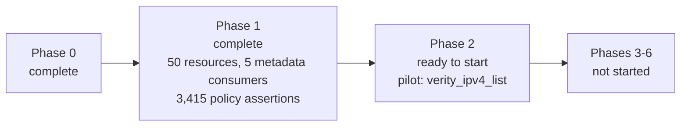

# Schema-driven refactor status

Last reviewed: 2026-09-15

This document tracks implementation against [refactor_plan.md](refactor_plan.md).
Commit state is intentionally not tracked here; use Git status and history for
that information. Existing unrelated `.gitignore` and planning-file changes are
not treated as refactor deliverables.

## Current position

All six pre-migration gates from the plan's executive recommendation pass.

A deterministic registry now covers **all 50 API-backed Terraform resources**
across 49 endpoints, and every one is checked field by field against the schema
the provider actually ships. The 51st, `verity_operation_stage`, is not
API-backed; the plan keeps it bespoke (lines 402, 571, 573), so it is excluded by
design rather than missing.

The registry also drives the provider: mode compatibility and bulk transport
metadata are generated from it, each pinned to a golden file of the values
that shipped. No production resource has moved to the generic lifecycle engine,
so Phase 2 has not started.

### Coverage summary

| Measure | Count |
| --- | --- |
| Registry resources | 50 of 50 API-backed |
| Endpoints represented | 49 of 64 |
| Field paths represented | 1,068 (1,063 managed, 310 nested) |
| Nested collection strategies in use | 54 `indexed_patch`, 27 `singleton` |
| Reference / auto-assignment pairs modelled | 92 / 15 |
| Lifecycle policies verified against legacy | 4 of 5 (3,415 assertions) |
| API fields recorded as unmanaged | 5 |
| Reviewed override file | 3,340 lines |

Every Terraform resource the provider registers is now represented, so the
earlier blocked list is empty. Resolving it needed three things: representing an
API object the document declares with no properties (Device Settings, SFP
Breakout ship it as an empty block), recursing into blocks nested inside blocks
(Fabric's `object_properties.system_graphs`), and recording that the API itself
documents `verity_gateway.fabric_interconnect` with an empty description.

The remaining 15 unrepresented endpoints back no Terraform resource. Five fail a
spec rule (`/alarms/mask`, `/readmode`, and three PATCH-only endpoints); the rest
are aggregate or action endpoints such as `/config` and `/backups` that need a
deliberate decision about whether they should be resources at all.



## Phase 0: characterize and freeze behavior

| Plan item | Status | Evidence / remaining work |
| --- | --- | --- |
| Commit reproducible 6.6 mode-specific inputs | Implemented | `specs/openapi/6.6/{datacenter,campus,manifest}.json`; `specgen verify` checks canonical format and SHA-256 checksums. |
| Offline CI verification | Implemented | CI runs `specgen verify` and deterministic extraction check. |
| Schema golden file for current resources | Implemented | `tests/unit/testdata/schema_golden_v6_6.json` captures 51 registered resource schema versions, state types, flags, and deterministic modifier/validator parameters. |
| Request/response golden fixtures for every resource | Implemented | 149 fixtures across all 50 resources in `tests/unit/lifecycle/testdata/golden/`: the request each resource sends on create and update, and the state its read path produces. `TestGoldenWireFixtures` replays them, and `TestUpdateOnlyResourceGoldenPatch` covers the one resource the acceptance harness cannot carry across an update. `UPDATE_GOLDEN=1` regenerates both. |
| Read and PATCH field-coverage expansion | Implemented | PATCH bodies and decoded read state are recorded per resource by the golden fixtures, and the coverage table covers all 50 resources rather than 45. |
| Full exception inventory | Implemented | [docs/exception_inventory.md](docs/exception_inventory.md) classifies every deviation from the common resource contract into the plan's five categories. Behavior all 49 API-backed resources share is explicitly not counted as an exception. Two items need follow-up: `verity_tenant.vrf_name` needs a validator the override format cannot yet express, and `verity_packet_broker.ipv6_permit.enable` looks like a defect rather than a policy. |
| API range and lifecycle-policy design | Implemented | `internal/spec` defines numeric API ranges, deterministic literals, and all five lifecycle policies. |
| Framework generic value bridge spike | Implemented | Protocol-level `value_bridge_test.go` proves recursive generic Framework reads/writes, including null and unknown values. |
| IPv4 List transport adapter spike | Implemented | `internal/transport` exact JSON tests plus bulk-manager integration cover omission, false/empty values, explicit-null errors, and no-panic diagnostics. |
| Version-zero state contract and upgrade mechanism | Implemented | Snapshot captures current state types; `internal/genericresource/state.go` registers prior schemas/upgraders and has a real Framework v0-to-v1 test. |
| Stable provider registration | Implemented | `Resources()` is mode-independent; contract test verifies names/order/state types before configuration and in both modes. |
| Final nullable/reset policy decision | Mostly implemented | The design is settled and documented: nullability follows the transform rule, and clear-and-create behavior follows the wire type. Four of five policies are verified against the implementation for every field. Decided. Explicit null is numeric-only and enforced in validation; unknown handling is settled by `release/6.6`, whose gating on configured attributes puts nullable numerics in the same place as every other omission; and an unresolvable identity is an intended behavior change recorded under Intended behavior changes. |

### Phase 0 exit criterion

Met. One intended behavior change is recorded, separate from the parity work.

Behavior is measurable through 149 golden fixtures and the schema golden file;
intended behavior changes are separated from refactoring ones and recorded as
they were made; committed inputs regenerate offline under `specgen verify`; the
field-policy design is settled and four of five policies are verified against the
implementation; and the Framework, transport, registration, and state-contract
spikes all pass.

Two follow-ups are recorded rather than blocking, both in
[docs/exception_inventory.md](docs/exception_inventory.md): a validator the
override format cannot express, and a field whose collection offers no update
path at all.

### Golden wire fixtures

Every other check in this repository compares the registry against the legacy
*source*: schema shape, modes, aliases, lifecycle policies. That proves the
registry describes the implementation; it cannot prove a replacement puts the
same bytes on the wire. Phase 2 is judged on behavior parity, and parity needs a
recorded baseline.

`tests/unit/lifecycle/testdata/golden/` is that baseline: 149 fixtures across
three directions and all 50 resources, captured from the handwritten resources as
they ship.

| Fixture | Count | Pins |
| --- | --- | --- |
| `put.json` | 49 | the full create request |
| `patch.json` | 50 | which fields an update carries |
| `state.json` | 50 | the Terraform state the read path decodes |

Configurations are generated from the shipped schema and now recurse into blocks
nested inside blocks, so Fabric's `object_properties.system_graphs` — the
provider's only two-level nesting — is exercised rather than silently omitted.

`verity_sfp_breakout` has no create fixture and never will: it refuses both create
and delete by design, representing hardware that can only be read and updated. Its
read state is captured by import, and its update is captured by
`TestUpdateOnlyResourceGoldenPatch`, which drives the bulk manager directly
against a recording server. That keeps its reachable behavior pinned without the
Terraform lifecycle the resource cannot complete.

A resource moving to the generic engine re-runs the same test, so a behavior
change surfaces as a diff in a committed file rather than silently. The PATCH
fixtures are the most revealing — `verity_ipv4_list` sends only
`{"enable": false}`, which is where omission and explicit-null behavior shows —
and the state fixtures cover the direction the request fixtures cannot: a decoder
that dropped a field or read it as the wrong type fails here instead of passing
because nothing asserted on the decoded value.

The fixtures are regenerated deliberately with `UPDATE_GOLDEN=1`, never to make a
red test pass. Negative controls confirm both directions bite: changing a recorded
empty string to an explicit null fails the request check, and removing one field
from a recorded state fails the read check.


### Descriptions follow the API

Field descriptions are taken from `specs/openapi/6.6/{datacenter,campus}.json`. 248
legacy descriptions that had drifted from the API text were aligned to it across
36 resources, so an API documentation improvement now reaches the provider by
regenerating rather than by hand-editing Go schemas.

An override remains in only three cases, all of which the API cannot supply:

| Case | Count |
| --- | --- |
| Resource-level descriptions, which OpenAPI does not carry per endpoint | 46 |
| Fields the API documents with no description at all | 71 |
| ACL v4/v6, where one endpoint backs two resources and OpenAPI can only say "IPv4" | 10 |

## Phase 1: introduce and validate the spec registry

| Plan item | Status | Evidence / remaining work |
| --- | --- | --- |
| `ResourceSpec` / `FieldSpec` types and strict validation | Implemented | `internal/spec/model.go`, `validate.go`, and tests validate modes, ranges, literal types, ownership, policies, links, and collection strategies. |
| First generated registry artifact | Implemented | `specs/overrides.yaml` is the reviewed source and `specs/generated_registry.json` is its deterministic merged output. No handwritten resource seed remains. |
| OpenAPI extraction | Implemented | `specgen extract` reads both canonical inputs and produces `specs/generated_manifest.json`. It reports 64 mutable endpoint candidates with GET/PUT/PATCH/DELETE availability, request wrappers, documented response collection keys, delete query-parameter shapes, recursive fields, array item types, mode presence, and review-required items. Missing API response schemas and cache keys remain explicit override requirements. |
| Override format and merge | Implemented for scalar, singleton-object, nested, and scalar-list shapes | The format supports recursive fields, collection strategies, reference and auto-assignment pairs derived from the API's own suffix convention and enums, scalar-list element kinds, per-field modes and API-version ranges, unmanaged API fields, and several Terraform resources on one endpoint discriminated by `fixed_headers`. `specgen registry` resolves the declared defaults and validates target paths, field and item types, modes, documented wrapper aliases, delete-parameter requiredness, and every lifecycle policy before emitting the expanded registry. Undocumented response aliases remain reviewed override data, covered by legacy parity. |
| Generate current mode/version, compatibility, JSON key, bulk adapter, and constructor metadata | Implemented | `specgen metadata` generates `internal/utils/generated_mode_metadata.go` and `internal/bulkops/generated_bulk_metadata.go`. Mode compatibility is fully generated: `pendingModeFields` is empty and only the non-API `verity_operation_stage` remains hand-maintained. The bulk registry no longer writes its own resource type or the ACL header split key; both are filled from the registry at init and fail loudly if a bulk key is unknown. Both are pinned to golden files. JSON keys and constructor registration are generated too: no resource declares its own endpoint or cache-key constant, and `getAllResources` enumerates the registry rather than a handwritten list. All five metadata consumers the plan names are now registry-driven. |
| `specgen --check` in CI | Implemented | CI checks canonical inputs, extraction, generated-registry drift, the three generated metadata files, and runs the legacy parity tests. |
| Report unresolved/ambiguous API fields | Implemented | The manifest marks fields and resources requiring policy, alias, or strategy review, and the merge refuses any extracted field without an explicit override. Legacy comparison covers all 50 represented resources; see Legacy parity coverage. |
| Validate every current resource and field against ranges/policies | Implemented | All 50 API-backed resources and 1,068 field paths validate against API-version ranges and modes; the 1,063 managed paths also carry complete lifecycle policies, and each is checked against the shipped Terraform schema. `update_clear`, `create_null`, `response_absence`, and `unknown_plan` are verified against legacy behavior across all 50 resources at every nesting depth (3,415 assertions, 135 fields excluded by named category). `state_ownership` is a pure function of `access` and enforced by validation, so it needs no separate check. |

### Generated provider metadata

`specgen metadata` emits two files, both drift-checked in CI:

| File | Supplies | Hand-maintained remainder |
| --- | --- | --- |
| `internal/utils/generated_mode_metadata.go` | `ResourceCompatibility`, `ModeFields` | `verity_operation_stage` only, which is not API-backed |
| `internal/bulkops/generated_bulk_metadata.go` | bulk resource types, ACL header split key | none |
| `internal/provider/generated_resource_keys.go` | per-resource endpoint name, cache key, response collection key, canonical registration order | none |

Both changes had to alter nothing observable, so each is pinned to a frozen
golden file of the values that shipped: `internal/utils/testdata/mode_metadata_golden.json`
covers 51 compatibility entries and 1054 field entries, and
`internal/bulkops/testdata/bulk_metadata_golden.json` covers 49 bulk keys. Mode
data decides which fields reach a datacenter or campus system, and the resource
type keys every bulk operation's status tracking, so neither could be allowed to
drift while its source moved.

The bulk registry previously repeated its own map key in all 49 entries and
carried the ACL split key as a literal. Both are now filled at init from the
registry, and an unknown bulk key panics rather than running with an empty
resource type.

The resource implementations previously declared their own endpoint name and
cache key: 49 `ResourceType` constants and 4 `CacheKey` constants, none of which
remain. Both now come from the generated key table, so the endpoint name a
resource addresses has one definition instead of three, and
`TestGeneratedResourceKeysCoverEveryResource` fails if the table does not serve
every registered resource.

Registration follows the registry too. `getAllResources` enumerated a handwritten
slice of 51 constructors; it now walks the generated canonical order and looks
each one up, appending the resources that have no API endpoint. The constructors
stay handwritten because they bind typed SDK calls, but which resources the
provider registers, and in what order, is the registry's. The plan asks for
exactly this at line 334. `TestRegistrationFollowsTheRegistry` fails if the
constructor map and the registry drift in either direction, if a constructor
reports a different Terraform type than it is keyed under, or if the order stops
being canonical.

This also replaces `tools/compare_schemas.py` as the source of
`internal/utils/schema.go`, removing the second, independently maintained
definition of mode data that the plan identifies as a duplication risk.

### Legacy parity coverage

`TestGeneratedSpecsMatchLegacySchemas`, `TestGeneratedSpecsMatchLegacyBulkRegistry`,
and `TestGeneratedPoliciesMatchLegacyBehavior` run over every resource in the
generated registry and fail if the mapping tables do not cover it, so a new
override cannot be added without parity coverage.

Asserted against legacy code today:

- Terraform type name, from the resource's own `Metadata`.
- Resource modes against `utils.ResourceCompatibility`. This is the only check
  tying mode extraction from datacenter/campus OpenAPI presence to shipped behavior.
- Cache key against the resource's own constant or accessor, and bulk key against `bulkops.resourceRegistry`.
- Fixed headers against the legacy `HeaderSplitKey`, so a discriminator cannot drift from the key the bulk manager splits batches on.
- Top-level attribute plus block count against generated field count, in both
  directions, so a legacy attribute missing from the registry fails.
- Per field: kind, description, sensitivity, required/optional/computed, and RequiresReplace.
- Nested blocks: description and nested attribute count, then each nested field as above.
- Nested blocks inside blocks, recursively, which Fabric needs for
  `object_properties.system_graphs`.
- Constructors are taken from the provider's own registration list, so a generated
  resource with no shipped counterpart fails rather than being skipped.
- `update_clear`, `create_null`, and `response_absence` against the create, update,
  and read helpers each resource actually calls.
- Every mode-restricted field against the `ModifyPlan` nullifier lists, so a field
  that does not apply to the running mode cannot silently show as "known after
  apply" because it was left out of a handwritten list.

Lifecycle policies are now largely verified against the legacy implementation
rather than assumed. Four of the five are checked at every nesting depth: 2,575
assertions, with no disagreements. The fifth, `state_ownership`, is a pure
function of `access`, which the schema parity test checks against the shipped
Terraform schema, and `validateOwnership` enforces the mapping, so it carries no
independent claim to verify. Coverage is exact rather than best-effort —
every registry resource must appear in the evidence and every field must either
carry evidence or fall into a named excluded category, so a resource cannot lose
verification silently.

### Lifecycle policies are verified against legacy behavior

The registry originally assigned one profile to every managed field. Comparing
that against what the resources actually do found three separate errors:

| Policy | What the registry claimed | What legacy does | Fields wrong |
| --- | --- | --- | --- |
| `update_clear` | always `api_null` | `""`, `false`, or `0` unless the field uses a nullable helper | 282 |
| `create_null` | always `omit` | explicit null for nullable fields | 120 |
| `response_absence` | `error` for identity fields | every read helper returns Terraform null | 48 |
| `unknown_plan` | `preserve_state` | omitted from the request, then supplied by the read that follows | 521 |

None of these are visible in the Terraform schema, so the schema parity harness
could not have caught them. Nothing consumed the policies yet, so no behavior was
affected; the generic engine would have been the first consumer.

`update_clear` and `create_null` are now derived from the same wire capability:
only a nullable field can carry an explicit null, so everything else is omitted on
create and cleared to its zero value on update.

Nullability itself follows the API's design rule rather than the committed
documents. Only numerics are nullable, and `tools/process_swagger.py` applies that
to the SDK input by marking every number and integer nullable except one named
`index`, which identifies a collection entry and must always be present. The
committed documents are the raw export and predate that transform, so reading
their flag directly needed 26 per-field exceptions; applying the rule needs none
and agrees with the legacy implementation on all 490 evidenced non-identity
fields. It also settles the 54 nested `index` fields, which the raw flag left
ambiguous. The plan notes the same transform at line 238.

`response_absence` for identity fields was changed from `error` to
`terraform_null` to match the read helpers. Whether a missing identity should
instead be a hard diagnostic is a real question, but it belongs to the open
nullable/reset decision rather than to an assumption baked into the registry.

`TestGeneratedPoliciesMatchLegacyBehavior` pins all four against
`internal/provider/testdata/legacy_field_policies.json`. It excludes a reference
or auto-assignment pair by reading the relationship the registry records, not by
matching the `_ref_type_` and `_auto_assigned_` suffixes: inferring the pairing a
second time would reinstate the convention the registry exists to replace, and
would keep passing if the registry stopped recording a pair at all.

135 fields are excluded from policy verification, and each is a field the question
does not apply to rather than one lacking evidence: 81 objects and arrays, which
their collection strategy clears rather than a wire value, and 54 collection
identity fields, which name an entry and are always sent. Reference and
auto-assignment pair halves used to be excluded too; they are now verified through
their own helpers.

Reaching nested fields meant reading four distinct update paths, not one. Beyond
the shared compare helpers, a singleton object clears a member by dropping the
key, an indexed collection may carry its handler inline or in a variable, and a
`Set*Fields` call guarded by an equality check also clears by omission because
those helpers skip nulls. `UpdateClearOmit` was added to the policy vocabulary to
express the first and third; the Phase 0 design had no value for "omit the key".

The pairing itself is now modelled. The plan lists paired `*_ref_type_` and
`*_auto_assigned_` behavior among the things a plain schema cannot express, and
the registry records all 92 reference pairs and 15 auto-assignment pairs across
the represented resources, with no companion left unpaired. Allowed reference
types come from the companion field's own enum in the committed documents rather
than from a hand-written list, so `verity_aaa_profile.ldap_profile` records
`type_field: ldap_profile_ref_type_` and `allowed_types: [ldap_profile]` without
any override. `TestGeneratedPairsAreModelled` fails if a companion exists whose
partner records no relationship.

What remains unverified for these fields is their lifecycle policies, not their
structure: each resource drives the pair with bespoke logic instead of the shared
helpers, so no policy can be read from them mechanically.

Explicit null is numeric-only on this API, and the registry now enforces it:
`internal/spec` rejects any non-numeric field declaring `api_null` or marked
nullable. That caught 81 containers carrying `api_null` from a placeholder in the
`container` profile — a list or object is cleared by omitting it or by its
collection strategy, never by a null — along with three stale test fixtures.

`unknown_plan` follows the same create capability for every field. One the request
omits when null is omitted when unknown too, and every resource re-reads after
create and update, so the server supplies the value.

Nullable numerics reach the same place by a different route, which `release/6.6`
settles: their path is gated on whether the attribute was written in the `.tf`
file at all, read by `ParseResourceConfiguredAttributes`, so an unwritten field is
skipped and read back exactly like any other omission, and a written one resolves
to a known value before apply. There is no separate unknown behavior to express,
so all 932 managed fields carry `omit_and_read` and none carry `preserve_state`.

The reference and auto-assignment pairs are verified too. `release/6.6` settles
how they behave: `applyRefTypeFieldChange` writes `PtrString("")` for a cleared
half in every branch, and the inline auto-assignment logic writes
`NewNullableInt64(nil)` for a cleared numeric and `PtrBool` for its flag. All 92
reference pairs are string/string and all 15 auto-assignment flags are bool, so
the pairs follow the same wire-type rule as everything else despite their own
helpers. The evidence records which helper drives each field, so a resource
switching paths would show up rather than passing silently.

Reading them also found a rule conflict worth keeping: a reference pair inside a
singleton clears to `""`, not by omission, because the pair helper writes the
value directly. Lag and Switchpoint both carry one inside `object_properties`.

Still unverified: 136 fields, and only one of them for want of evidence.

Not yet asserted against legacy code: validators, defaults, plan modifiers other
than RequiresReplace, request/response payload shapes, delete parameters, and
request wrapper keys. Those are validated against OpenAPI extraction instead,
which for delete parameters now includes a requiredness check rather than a bare
name match.

### Phase 1 exit criterion

The plan requires "one generated registry accounts for every existing resource,
field path, alias, operation, mode, version, lifecycle policy, and nested
strategy while old resources still run, and every pre-migration gate in the
executive recommendation passes."

Registry coverage today: all 50 API-backed resources, 1,068 field paths (1,063
managed and 5 explicitly unmanaged, 310 of them nested), 49 of 64 endpoints, two
nested collection strategies (54 `indexed_patch`, 27 `singleton`), and 92
reference plus 15 auto-assignment pairs. Old resources still run untouched.

Every structural clause of the criterion is met: resource, field path, alias,
operation, mode, version, and nested strategy. All five metadata consumers the
plan names are generated from the registry, so the third Phase 1 bullet is
complete as well.

One clause is not fully met. **Lifecycle policies are largely but not entirely
verified.** Four of the five are checked against the legacy implementation across
all 50 resources at every nesting depth, 3,415 assertions with no disagreements;
the fifth, `state_ownership`, is a pure function of `access` and enforced by
validation, so it carries no independent claim. What remains unverified:

| Unverified | Count | Why |
| --- | --- | --- |
| Fields excluded by named category | 345 | Objects and arrays, collection identity fields, reference and auto-assignment pair halves, and one field whose collection has no update path at all |

Every policy that could be checked was wrong when first assigned — `update_clear`
for 282 fields, `create_null` for 120, `response_absence` for 48, `unknown_plan`
for 521. That record is the reason the remainder is called out rather than
assumed correct.

**Phase 0's deliverables are complete.** Request and read-path fixtures exist for
every resource that supports create, the coverage table covers all 50, and the
exception inventory classifies every deviation from the common contract. The exit
criterion is met: behavior is measurable, intended behavior changes are separated
from refactoring ones, committed inputs regenerate offline, the field-policy
design is settled, and all four spikes pass.

Both remaining decisions are made. The identity-resolution change is recorded
under Intended behavior changes, to be implemented with the generic reader, and
the Packet Broker defect it was paired with is fixed.

### Pre-migration gates

Phase 2 may not begin until all six gates from the plan's executive
recommendation pass. They do:

| Gate | Status | Evidence |
| --- | --- | --- |
| 1. Versioned, mode-specific OpenAPI inputs committed and reproducible | Pass | `specs/openapi/6.6/` with checksum manifest; `specgen verify` in CI |
| 2. API-version applicability and full field lifecycle policies represented and validated | Pass | `internal/spec/validate.go`; all 1,068 field paths carry validated kinds, modes, and version ranges, and the 1,063 managed ones carry complete lifecycle policies. The 5 unmanaged fields deliberately carry none, since Terraform does not surface them. |
| 3. Framework spike proves generic plan/config reads and state writes without losing null or unknown | Pass | `tests/unit/lifecycle/value_bridge_test.go` |
| 4. Generated transport adapter proves exact wire JSON across the typed OpenAPI/bulk boundary | Pass | `internal/transport/ipv4_list_test.go` |
| 5. Resource registration fixed before configuration and mode-independent | Pass | `TestResourcesAreModeIndependentAndStable` |
| 6. Version-zero state contract and upgrader mechanism tested | Pass | `internal/genericresource/state_test.go` |

The gates are not the constraint. The two Phase 1 items above are, together with
the Phase 0 blockers listed earlier: golden fixtures, Read/PATCH coverage, and
the exception inventory.

## Intended behavior changes

Phase 0 requires intended behavior changes to be separated from refactoring ones.
Everything else in this document is parity work: the registry describes what the
provider does today, and the golden fixtures pin it. The entries here are the
exceptions, decided deliberately and not yet implemented.

### A response that cannot identify its object is an error

**Legacy behavior, unchanged and still recorded as parity.** Every resource reads
its identity with `MapStringFromAPI(data["name"])`, which yields a Terraform null
when the member is absent. The registry records `response_absence: terraform_null`
for identity fields to match, and the parity fixtures are not altered.

**Intended generic behavior.** The generic engine raises a diagnostic naming the
resource and the identity it could not resolve, rather than writing a null into a
Required attribute.

The path is unreachable today: `FindResourceByAPIName` locates an object by
reading that same `name` member, so an object can only be found if its identity
was readable. A later absence would mean an internally inconsistent response, and
a null would hide it.

**The contract is that the identity must be resolvable, not that the response
carries a `name` member.** API 6.7 is expected to drop the member and identify
objects by their collection key instead. When those inputs are committed, the
source belongs in versioned registry metadata on `APIResourceSpec` so the decoder
reads a declared source rather than guessing, and the change stays deliberate and
testable. Nothing is added for it now: 6.6 is the only committed version, the
member is present in every response it describes, and speculative vocabulary
would carry one value in use and no test.

**Implement with the generic reader**, together with a contract test covering a
response whose object cannot be identified. The divergence is marked here rather
than folded into a parity fixture.

## SDK reproducibility baseline

`tools/generate_openapi_sdk.sh` now transforms only the committed 6.6 inputs
and invokes OpenAPI Generator 7.25.0 by immutable Docker digest in a temporary
directory. Its `--check` mode currently reports drift against the tracked
`openapi/` directory. This is expected to remain a **blocking baseline
reconciliation task**: the SDK must be regenerated, its large diff reviewed,
and provider compilation/parity revalidated before the SDK check is enabled as
a required CI step. The script does not modify `openapi/` unless `--write` is
explicitly requested.

## Later phases

| Phase | Status | Start condition |
| --- | --- | --- |
| Phase 2: generic scalar lifecycle pilot | Not started | Phase 0 and Phase 1 exit criteria must pass. The intended first pilot is `verity_ipv4_list`. |
| Phase 3: shared semantic policies | Not started | Begins after scalar pilot parity; Badge follows nullable/reset and singleton-policy contracts. |
| Phase 4: indexed collections | Not started | Begins after shared field policies are stable. |
| Phase 5: complex/exceptional resources | Not started | Begins after collection strategies are proven. |
| Phase 6: remove legacy duplication | Not started | Begins only after all API-backed resources use the generic engine. |

## Completed implementation artifacts

- `specs/openapi/6.6/`: committed-style, checksummed canonical API inputs.
- `tools/specgen/`: canonicalization, verification, deterministic API-shape extraction, registry generation, and provider metadata generation.
- `specs/generated_manifest.json`: extracted 6.6 coverage report.
- `specs/overrides.yaml`: reviewed non-OpenAPI behavior, stated as deviations from named defaults.
- `specs/generated_registry.json`: deterministic merged registry plus explicit unrepresented-resource report.
- `internal/spec/`: provider-owned spec vocabulary and registry validation.
- `internal/transport/`: provider-owned wire values and initial IPv4 List SDK adapter.
- `internal/genericresource/state.go`: reusable state-upgrader registration contract.
- `tests/unit/lifecycle/`: version-zero schema golden file and Framework value-bridge contract tests.
- `internal/bulkops/`: error-aware adapter integration that preserves the legacy typed path.
- `internal/utils/generated_mode_metadata.go`: generated mode compatibility, with a golden file pinning it to the values that shipped.
- `internal/bulkops/generated_bulk_metadata.go`: generated bulk transport facts, likewise pinned by a golden file.
- `internal/provider/testdata/legacy_field_policies.json`: recorded legacy create, update, and read behavior per field, the evidence behind the verified lifecycle policies.
- `internal/provider/legacy_schema_dump_test.go`: authoring aid that dumps the shipped schemas; inert unless `DUMP_OUT` is set.

## How to verify this status

```bash
go vet ./...
go run ./tools/specgen verify   --input-dir specs/openapi/6.6
go run ./tools/specgen extract  --input-dir specs/openapi/6.6 --output specs/generated_manifest.json --check
go run ./tools/specgen registry --input-dir specs/openapi/6.6 --overrides specs/overrides.yaml \
                                --output specs/generated_registry.json --check
go run ./tools/specgen metadata --registry specs/generated_registry.json \
                                --output internal/utils/generated_mode_metadata.go \
                                --bulk-output internal/bulkops/generated_bulk_metadata.go \
                                --keys-output internal/provider/generated_resource_keys.go --check
go test ./... -count=1
```

The full suite runs in roughly one minute with the delay variables the CI
workflow sets; without them the lifecycle package alone takes far longer.
`internal/bulkops/types.go` fails `gofmt` at HEAD, predating this work.

## Recommended next slice

1. Implement the response-identity contract described below, so the generic
   engine resolves a resource's identity from a declared source rather than
   assuming the response carries a `name` member.
2. Decide the two items the exception inventory leaves open: a validator for
   `verity_tenant.vrf_name`, which needs `FieldSpec.Validators` wired into the
   override format, and whether `verity_packet_broker.ipv6_permit.enable` is a
   defect to fix rather than a behavior to replicate.

Keep reviewed overrides as the only editable resource metadata and generated
registry output as the parity target.
