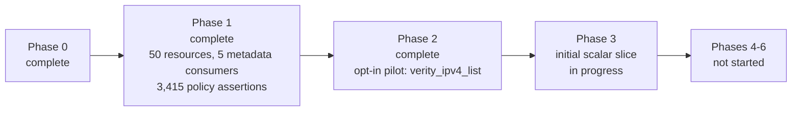

# Schema-driven refactor status

Last reviewed: 2026-09-17

This document tracks implementation against [refactor_plan.md](refactor_plan.md).
Commit state is intentionally not tracked here; use Git status and history for
that information. Existing unrelated `.gitignore` and planning-file changes are
not treated as refactor deliverables.

## Current position

**Phases 0, 1, and 2 are complete**, and all six pre-migration gates from the
plan's executive recommendation pass. Phase 2 closed as an opt-in pilot: the
generic engine serves `verity_ipv4_list` behind a switch that remains off by
default.

A deterministic registry covers **all 50 API-backed Terraform resources** across
49 endpoints, and every one is checked field by field against the schema the
provider actually ships. The 51st, `verity_operation_stage`, is not API-backed;
the plan keeps it bespoke (lines 402, 571, 573), so it is excluded by design
rather than missing.

The registry also drives the provider. All five metadata consumers the plan names
are generated from it — mode compatibility, bulk transport metadata, per-resource
JSON keys, and registration order — each pinned to a golden file of the values
that shipped. Four of the five lifecycle policies are verified against the legacy
implementation, 3,415 assertions, and the fifth follows from `access`.

The Phase 2 engine reproduces the golden fixtures captured from the handwritten
`verity_ipv4_list` byte for byte. **Phase 3's implementation is complete up to
what needs Phase 4, and Phase 4 is in progress:** the engine now serves 46 of the
50 API-backed resources behind the same opt-in switch. Reference pairs, nullable
numerics at the top level and inside list entries, endpoint-selecting parameters,
auto-assignment pairs, singleton objects, and indexed collections are
implemented. Four resources remain; see "Phase 4: indexed collections".

A live 6.6 run with `VERITY_GENERIC_RESOURCES=verity_ipv4_list` confirmed that
the generic implementation registered, batched two creates into one
`PUT /api/ipv4lists`, and encoded the expected `ipv4_list_filter` request body.
The generic IPv4 List implementation is therefore validated in the live
environment as well as by the parity suite.

Four things are carried forward rather than closed, none of them on that pilot's
path. Adding an indexed child without naming its index does not work in either
spelling the schema allows, characterized in
`tests/unit/lifecycle/index_zero_test.go` and left for Phase 4's collection
engine. `verity_tenant.vrf_name` needs a validator the override format cannot
express. `unknown_plan: omit_and_read` is a create-path claim, since the
`CompareAndSet*Field` helpers are unguarded for every kind. And `3e76e76` is not
independently green; see "A known gap in the commit history".

### Coverage summary

| Measure | Count |
| --- | --- |
| Registry resources | 50 of 50 API-backed |
| Endpoints represented | 49 of 64 |
| Field paths represented | 1,068 (1,063 managed, 310 nested) |
| Nested collection strategies in use | 54 `indexed_patch`, 27 `singleton` |
| Reference / auto-assignment pairs modelled | 92 / 15 |
| Lifecycle policies verified against legacy | 4 of 5 (3,415 assertions) |
| API fields recorded as unmanaged | 5 |
| Reviewed override file | 3,340 lines |

Every Terraform resource the provider registers is now represented, so the
earlier blocked list is empty. Resolving it needed three things: representing an
API object the document declares with no properties (Device Settings, SFP
Breakout ship it as an empty block), recursing into blocks nested inside blocks
(Fabric's `object_properties.system_graphs`), and recording that the API itself
documents `verity_gateway.fabric_interconnect` with an empty description.

The remaining 15 unrepresented endpoints back no Terraform resource. Five fail a
spec rule (`/alarms/mask`, `/readmode`, and three PATCH-only endpoints); the rest
are aggregate or action endpoints such as `/config` and `/backups` that need a
deliberate decision about whether they should be resources at all.



## Phase 0: characterize and freeze behavior

| Plan item | Status | Evidence / remaining work |
| --- | --- | --- |
| Commit reproducible 6.6 mode-specific inputs | Implemented | `specs/openapi/6.6/{datacenter,campus,manifest}.json`; `specgen verify` checks canonical format and SHA-256 checksums. |
| Offline CI verification | Implemented | CI runs `specgen verify` and deterministic extraction check. |
| Schema golden file for current resources | Implemented | `tests/unit/testdata/schema_golden_v6_6.json` captures 51 registered resource schema versions, state types, flags, and deterministic modifier/validator parameters. |
| Request/response golden fixtures for every resource | Implemented | 149 fixtures across all 50 resources in `tests/unit/lifecycle/testdata/golden/`: the request each resource sends on create and update, and the state its read path produces. `TestGoldenWireFixtures` replays them, and `TestUpdateOnlyResourceGoldenPatch` covers the one resource the acceptance harness cannot carry across an update. `UPDATE_GOLDEN=1` regenerates both. |
| Read and PATCH field-coverage expansion | Implemented | PATCH bodies and decoded read state are recorded per resource by the golden fixtures, and the coverage table covers all 50 resources rather than 45. |
| Full exception inventory | Implemented | [docs/exception_inventory.md](docs/exception_inventory.md) classifies every deviation from the common resource contract into the plan's five categories. Behavior all 49 API-backed resources share is explicitly not counted as an exception. One item needs follow-up: `verity_tenant.vrf_name` needs a validator the override format cannot yet express. The one other follow-up, `verity_packet_broker.ipv6_permit.enable`, turned out to be a provider defect and is fixed. |
| API range and lifecycle-policy design | Implemented | `internal/spec` defines numeric API ranges, deterministic literals, and all five lifecycle policies. |
| Framework generic value bridge spike | Implemented | Protocol-level `value_bridge_test.go` proves recursive generic Framework reads/writes, including null and unknown values. |
| IPv4 List transport adapter spike | Implemented | `internal/transport` exact JSON tests plus bulk-manager integration cover omission, false/empty values, explicit-null errors, and no-panic diagnostics. |
| Version-zero state contract and upgrade mechanism | Implemented | Snapshot captures current state types; `internal/genericresource/state.go` registers prior schemas/upgraders and has a real Framework v0-to-v1 test. |
| Stable provider registration | Implemented | `Resources()` is mode-independent; contract test verifies names/order/state types before configuration and in both modes. |
| Final nullable/reset policy decision | Implemented | The design is settled and documented: nullability follows the transform rule, and clear-and-create behavior follows the wire type. Four of five policies are verified against the implementation for every field. Decided. Explicit null is numeric-only and enforced in validation; unknown handling is settled, and settling it turned up a defect in the nullable setters that is now fixed, recorded under Intended behavior changes; and an unresolvable identity is an intended behavior change recorded there too. |

### Phase 0 exit criterion

Met. One intended behavior change is recorded, separate from the parity work.

Behavior is measurable through 149 golden fixtures and the schema golden file;
intended behavior changes are separated from refactoring ones and recorded as
they were made; committed inputs regenerate offline under `specgen verify`; the
field-policy design is settled and four of five policies are verified against the
implementation; and the Framework, transport, registration, and state-contract
spikes all pass.

One follow-up is recorded rather than blocking, in
[docs/exception_inventory.md](docs/exception_inventory.md): a validator the
override format cannot express. The other, a field whose collection offered no
update path, was a defect and is fixed.

### Golden wire fixtures

Every other check in this repository compares the registry against the legacy
*source*: schema shape, modes, aliases, lifecycle policies. That proves the
registry describes the implementation; it cannot prove a replacement puts the
same bytes on the wire. Phase 2 is judged on behavior parity, and parity needs a
recorded baseline.

`tests/unit/lifecycle/testdata/golden/` is that baseline: 149 fixtures across
three directions and all 50 resources, captured from the handwritten resources as
they ship.

| Fixture | Count | Pins |
| --- | --- | --- |
| `put.json` | 49 | the full create request |
| `patch.json` | 50 | which fields an update carries |
| `state.json` | 50 | the Terraform state the read path decodes |

Configurations are generated from the shipped schema and now recurse into blocks
nested inside blocks, so Fabric's `object_properties.system_graphs` — the
provider's only two-level nesting — is exercised rather than silently omitted.

`verity_sfp_breakout` has no create fixture and never will: it refuses both create
and delete by design, representing hardware that can only be read and updated. Its
read state is captured by import, and its update is captured by
`TestUpdateOnlyResourceGoldenPatch`, which drives the bulk manager directly
against a recording server. That keeps its reachable behavior pinned without the
Terraform lifecycle the resource cannot complete.

A resource moving to the generic engine re-runs the same test, so a behavior
change surfaces as a diff in a committed file rather than silently. The PATCH
fixtures are the most revealing — `verity_ipv4_list` sends only
`{"enable": false}`, which is where omission and explicit-null behavior shows —
and the state fixtures cover the direction the request fixtures cannot: a decoder
that dropped a field or read it as the wrong type fails here instead of passing
because nothing asserted on the decoded value.

The fixtures are regenerated deliberately with `UPDATE_GOLDEN=1`, never to make a
red test pass. Negative controls confirm both directions bite: changing a recorded
empty string to an explicit null fails the request check, and removing one field
from a recorded state fails the read check.


### Descriptions follow the API

Field descriptions are taken from `specs/openapi/6.6/{datacenter,campus}.json`. 248
legacy descriptions that had drifted from the API text were aligned to it across
36 resources, so an API documentation improvement now reaches the provider by
regenerating rather than by hand-editing Go schemas.

An override remains in only three cases, all of which the API cannot supply:

| Case | Count |
| --- | --- |
| Resource-level descriptions, which OpenAPI does not carry per endpoint | 46 |
| Fields the API documents with no description at all | 71 |
| ACL v4/v6, where one endpoint backs two resources and OpenAPI can only say "IPv4" | 10 |

## Phase 1: introduce and validate the spec registry

| Plan item | Status | Evidence / remaining work |
| --- | --- | --- |
| `ResourceSpec` / `FieldSpec` types and strict validation | Implemented | `internal/spec/model.go`, `validate.go`, and tests validate modes, ranges, literal types, ownership, policies, links, and collection strategies. |
| First generated registry artifact | Implemented | `specs/overrides.yaml` is the reviewed source and `specs/generated_registry.json` is its deterministic merged output. No handwritten resource seed remains. |
| OpenAPI extraction | Implemented | `specgen extract` reads both canonical inputs and produces `specs/generated_manifest.json`. It reports 64 mutable endpoint candidates with GET/PUT/PATCH/DELETE availability, request wrappers, documented response collection keys, delete query-parameter shapes, recursive fields, array item types, mode presence, and review-required items. Missing API response schemas and cache keys remain explicit override requirements. |
| Override format and merge | Implemented for scalar, singleton-object, nested, and scalar-list shapes | The format supports recursive fields, collection strategies, reference and auto-assignment pairs derived from the API's own suffix convention and enums, scalar-list element kinds, per-field modes and API-version ranges, unmanaged API fields, and several Terraform resources on one endpoint discriminated by `fixed_headers`. `specgen registry` resolves the declared defaults and validates target paths, field and item types, modes, documented wrapper aliases, delete-parameter requiredness, and every lifecycle policy before emitting the expanded registry. Undocumented response aliases remain reviewed override data, covered by legacy parity. |
| Generate current mode/version, compatibility, JSON key, bulk adapter, and constructor metadata | Implemented | `specgen metadata` generates `internal/utils/generated_mode_metadata.go` and `internal/bulkops/generated_bulk_metadata.go`. Mode compatibility is fully generated: `pendingModeFields` is empty and only the non-API `verity_operation_stage` remains hand-maintained. The bulk registry no longer writes its own resource type or the ACL header split key; both are filled from the registry at init and fail loudly if a bulk key is unknown. Both are pinned to golden files. JSON keys and constructor registration are generated too: no resource declares its own endpoint or cache-key constant, and `getAllResources` enumerates the registry rather than a handwritten list. All five metadata consumers the plan names are now registry-driven. |
| `specgen --check` in CI | Implemented | CI checks canonical inputs, extraction, generated-registry drift, the three generated metadata files, and runs the legacy parity tests. |
| Report unresolved/ambiguous API fields | Implemented | The manifest marks fields and resources requiring policy, alias, or strategy review, and the merge refuses any extracted field without an explicit override. Legacy comparison covers all 50 represented resources; see Legacy parity coverage. |
| Validate every current resource and field against ranges/policies | Implemented | All 50 API-backed resources and 1,068 field paths validate against API-version ranges and modes; the 1,063 managed paths also carry complete lifecycle policies, and each is checked against the shipped Terraform schema. `update_clear`, `create_null`, `response_absence`, and `unknown_plan` are verified against legacy behavior across all 50 resources at every nesting depth (3,415 assertions, 135 fields excluded by named category). `state_ownership` is a pure function of `access` and enforced by validation, so it needs no separate check. |

### Generated provider metadata

`specgen metadata` emits two files, both drift-checked in CI:

| File | Supplies | Hand-maintained remainder |
| --- | --- | --- |
| `internal/utils/generated_mode_metadata.go` | `ResourceCompatibility`, `ModeFields` | `verity_operation_stage` only, which is not API-backed |
| `internal/bulkops/generated_bulk_metadata.go` | bulk resource types, ACL header split key | none |
| `internal/provider/generated_resource_keys.go` | per-resource endpoint name, cache key, response collection key, canonical registration order | none |

Both changes had to alter nothing observable, so each is pinned to a frozen
golden file of the values that shipped: `internal/utils/testdata/mode_metadata_golden.json`
covers 51 compatibility entries and 1054 field entries, and
`internal/bulkops/testdata/bulk_metadata_golden.json` covers 49 bulk keys. Mode
data decides which fields reach a datacenter or campus system, and the resource
type keys every bulk operation's status tracking, so neither could be allowed to
drift while its source moved.

The bulk registry previously repeated its own map key in all 49 entries and
carried the ACL split key as a literal. Both are now filled at init from the
registry, and an unknown bulk key panics rather than running with an empty
resource type.

The resource implementations previously declared their own endpoint name and
cache key: 49 `ResourceType` constants and 4 `CacheKey` constants, none of which
remain. Both now come from the generated key table, so the endpoint name a
resource addresses has one definition instead of three, and
`TestGeneratedResourceKeysCoverEveryResource` fails if the table does not serve
every registered resource.

Registration follows the registry too. `getAllResources` enumerated a handwritten
slice of 51 constructors; it now walks the generated canonical order and looks
each one up, appending the resources that have no API endpoint. The constructors
stay handwritten because they bind typed SDK calls, but which resources the
provider registers, and in what order, is the registry's. The plan asks for
exactly this at line 334. `TestRegistrationFollowsTheRegistry` fails if the
constructor map and the registry drift in either direction, if a constructor
reports a different Terraform type than it is keyed under, or if the order stops
being canonical.

This also replaces `tools/compare_schemas.py` as the source of
`internal/utils/schema.go`, removing the second, independently maintained
definition of mode data that the plan identifies as a duplication risk.

### Legacy parity coverage

`TestGeneratedSpecsMatchLegacySchemas`, `TestGeneratedSpecsMatchLegacyBulkRegistry`,
and `TestGeneratedPoliciesMatchLegacyBehavior` run over every resource in the
generated registry and fail if the mapping tables do not cover it, so a new
override cannot be added without parity coverage.

Asserted against legacy code today:

- Terraform type name, from the resource's own `Metadata`.
- Resource modes against `utils.ResourceCompatibility`. This is the only check
  tying mode extraction from datacenter/campus OpenAPI presence to shipped behavior.
- Cache key against the resource's own constant or accessor, and bulk key against `bulkops.resourceRegistry`.
- Fixed headers against the legacy `HeaderSplitKey`, so a discriminator cannot drift from the key the bulk manager splits batches on.
- Top-level attribute plus block count against generated field count, in both
  directions, so a legacy attribute missing from the registry fails.
- Per field: kind, description, sensitivity, required/optional/computed, and RequiresReplace.
- Nested blocks: description and nested attribute count, then each nested field as above.
- Nested blocks inside blocks, recursively, which Fabric needs for
  `object_properties.system_graphs`.
- Constructors are taken from the provider's own registration list, so a generated
  resource with no shipped counterpart fails rather than being skipped.
- `update_clear`, `create_null`, and `response_absence` against the create, update,
  and read helpers each resource actually calls.
- Every mode-restricted field against the `ModifyPlan` nullifier lists, so a field
  that does not apply to the running mode cannot silently show as "known after
  apply" because it was left out of a handwritten list.

Lifecycle policies are now largely verified against the legacy implementation
rather than assumed. Four of the five are checked at every nesting depth: 2,575
assertions, with no disagreements. The fifth, `state_ownership`, is a pure
function of `access`, which the schema parity test checks against the shipped
Terraform schema, and `validateOwnership` enforces the mapping, so it carries no
independent claim to verify. Coverage is exact rather than best-effort —
every registry resource must appear in the evidence and every field must either
carry evidence or fall into a named excluded category, so a resource cannot lose
verification silently.

### Lifecycle policies are verified against legacy behavior

The registry originally assigned one profile to every managed field. Comparing
that against what the resources actually do found three separate errors:

| Policy | What the registry claimed | What legacy does | Fields wrong |
| --- | --- | --- | --- |
| `update_clear` | always `api_null` | `""`, `false`, or `0` unless the field uses a nullable helper | 282 |
| `create_null` | always `omit` | explicit null for nullable fields | 120 |
| `response_absence` | `error` for identity fields | every read helper returns Terraform null | 48 |
| `unknown_plan` | `preserve_state` | omitted from the request, then supplied by the read that follows | 521 |

None of these are visible in the Terraform schema, so the schema parity harness
could not have caught them. Nothing consumed the policies yet, so no behavior was
affected; the generic engine would have been the first consumer.

`update_clear` and `create_null` are now derived from the same wire capability:
only a nullable field can carry an explicit null, so everything else is omitted on
create and cleared to its zero value on update.

Nullability itself follows the API's design rule rather than the committed
documents. Only numerics are nullable, and `tools/process_swagger.py` applies that
to the SDK input by marking every number and integer nullable except one named
`index`, which identifies a collection entry and must always be present. The
committed documents are the raw export and predate that transform, so reading
their flag directly needed 26 per-field exceptions; applying the rule needs none
and agrees with the legacy implementation on all 490 evidenced non-identity
fields. It also settles the 54 nested `index` fields, which the raw flag left
ambiguous. The plan notes the same transform at line 238.

`response_absence` for identity fields was changed from `error` to
`terraform_null` to match the read helpers. Whether a missing identity should
instead be a hard diagnostic is a real question, but it belongs to the open
nullable/reset decision rather than to an assumption baked into the registry.

`TestGeneratedPoliciesMatchLegacyBehavior` pins all four against
`internal/provider/testdata/legacy_field_policies.json`. It excludes a reference
or auto-assignment pair by reading the relationship the registry records, not by
matching the `_ref_type_` and `_auto_assigned_` suffixes: inferring the pairing a
second time would reinstate the convention the registry exists to replace, and
would keep passing if the registry stopped recording a pair at all.

135 fields are excluded from policy verification, and each is a field the question
does not apply to rather than one lacking evidence: 81 objects and arrays, which
their collection strategy clears rather than a wire value, and 54 collection
identity fields, which name an entry and are always sent. Reference and
auto-assignment pair halves used to be excluded too; they are now verified through
their own helpers.

Reaching nested fields meant reading four distinct update paths, not one. Beyond
the shared compare helpers, a singleton object clears a member by dropping the
key, an indexed collection may carry its handler inline or in a variable, and a
`Set*Fields` call guarded by an equality check also clears by omission because
those helpers skip nulls. `UpdateClearOmit` was added to the policy vocabulary to
express the first and third; the Phase 0 design had no value for "omit the key".

The pairing itself is now modelled. The plan lists paired `*_ref_type_` and
`*_auto_assigned_` behavior among the things a plain schema cannot express, and
the registry records all 92 reference pairs and 15 auto-assignment pairs across
the represented resources, with no companion left unpaired. Allowed reference
types come from the companion field's own enum in the committed documents rather
than from a hand-written list, so `verity_aaa_profile.ldap_profile` records
`type_field: ldap_profile_ref_type_` and `allowed_types: [ldap_profile]` without
any override. `TestGeneratedPairsAreModelled` fails if a companion exists whose
partner records no relationship.

Their lifecycle policies are verified too. Each resource drives a pair with its
own helper rather than the shared ones, so the evidence records which helper is
used and what that helper sends; see the policy section below.

Explicit null is numeric-only on this API, and the registry now enforces it:
`internal/spec` rejects any non-numeric field declaring `api_null` or marked
nullable. That caught 81 containers carrying `api_null` from a placeholder in the
`container` profile — a list or object is cleared by omitting it or by its
collection strategy, never by a null — along with three stale test fixtures.

`unknown_plan` follows the same create capability for every field. One the request
omits when null is omitted when unknown too, and every resource re-reads after
create and update, so the server supplies the value.

Nullable numerics reach the same place by a different route. Their path is gated
on whether the attribute was written in the `.tf` file at all, read by
`ParseResourceConfiguredAttributes`, so an unwritten field is skipped and read
back exactly like any other omission. A written one was the gap: gating on
configuration rather than on the value left unknown falling through to the value
branch, where it serialized as zero. The two nullable setters now skip an unknown
like their non-nullable siblings, which is what makes the policy true; see
"An unknown nullable numeric is omitted, not sent as zero" below. All 932 managed
fields carry `omit_and_read` and none carry `preserve_state`, on the create path.

The reference and auto-assignment pairs are verified too. `release/6.6` settles
how they behave: `applyRefTypeFieldChange` writes `PtrString("")` for a cleared
half in every branch, and the inline auto-assignment logic writes
`NewNullableInt64(nil)` for a cleared numeric and `PtrBool` for its flag. All 92
reference pairs are string/string and all 15 auto-assignment flags are bool, so
the pairs follow the same wire-type rule as everything else despite their own
helpers. The evidence records which helper drives each field, so a resource
switching paths would show up rather than passing silently.

Reading them also found a rule conflict worth keeping: a reference pair inside a
singleton clears to `""`, not by omission, because the pair helper writes the
value directly. Lag and Switchpoint both carry one inside `object_properties`.

Unverified: the same 135 fields counted above, every one a field the policy
question does not apply to. No field is allowed to lack evidence — the check
errors on a missing record rather than skipping it.

Not yet asserted against legacy code: validators, defaults, plan modifiers other
than RequiresReplace, request/response payload shapes, delete parameters, and
request wrapper keys. Those are validated against OpenAPI extraction instead,
which for delete parameters now includes a requiredness check rather than a bare
name match.

### Phase 1 exit criterion

The plan requires "one generated registry accounts for every existing resource,
field path, alias, operation, mode, version, lifecycle policy, and nested
strategy while old resources still run, and every pre-migration gate in the
executive recommendation passes."

Registry coverage today: all 50 API-backed resources, 1,068 field paths (1,063
managed and 5 explicitly unmanaged, 310 of them nested), 49 of 64 endpoints, two
nested collection strategies (54 `indexed_patch`, 27 `singleton`), and 92
reference plus 15 auto-assignment pairs. Old resources still run untouched.

Every structural clause of the criterion is met: resource, field path, alias,
operation, mode, version, and nested strategy. All five metadata consumers the
plan names are generated from the registry, so the third Phase 1 bullet is
complete as well.

Met. One clause is worth stating precisely rather than leaving implied.
**Lifecycle policies are verified, four of the five against behavior.** Those four
are checked against the legacy implementation across all 50 resources at every
nesting depth, 3,415 assertions with no disagreements; the fifth,
`state_ownership`, is a pure function of `access` and enforced by validation, so
it carries no independent claim to check. 135 fields are excluded, and every one
is a field the policy question does not apply to:

| Excluded | Count | Why |
| --- | --- | --- |
| Containers | 81 | Cleared by their collection strategy rather than by a wire value |
| Collection identity fields | 54 | Always sent, never compared or cleared |

Every policy that could be checked was wrong when first assigned — `update_clear`
for 282 fields, `create_null` for 120, `response_absence` for 48, `unknown_plan`
for 521. Four for four is why each was chased down rather than assumed correct.

**Phase 0's deliverables are complete.** Request and read-path fixtures exist for
every resource that supports create, the coverage table covers all 50, and the
exception inventory classifies every deviation from the common contract. The exit
criterion is met: behavior is measurable, intended behavior changes are separated
from refactoring ones, committed inputs regenerate offline, the field-policy
design is settled, and all four spikes pass.

Both remaining decisions are made. The identity-resolution change is recorded
under Intended behavior changes, to be implemented with the generic reader, and
the Packet Broker defect it was paired with is fixed.

### Pre-migration gates

Phase 2 may not begin until all six gates from the plan's executive
recommendation pass. They do:

| Gate | Status | Evidence |
| --- | --- | --- |
| 1. Versioned, mode-specific OpenAPI inputs committed and reproducible | Pass | `specs/openapi/6.6/` with checksum manifest; `specgen verify` in CI |
| 2. API-version applicability and full field lifecycle policies represented and validated | Pass | `internal/spec/validate.go`; all 1,068 field paths carry validated kinds, modes, and version ranges, and the 1,063 managed ones carry complete lifecycle policies. The 5 unmanaged fields deliberately carry none, since Terraform does not surface them. |
| 3. Framework spike proves generic plan/config reads and state writes without losing null or unknown | Pass | `tests/unit/lifecycle/value_bridge_test.go` |
| 4. Generated transport adapter proves exact wire JSON across the typed OpenAPI/bulk boundary | Pass | `internal/transport/ipv4_list_test.go` |
| 5. Resource registration fixed before configuration and mode-independent | Pass | `TestResourcesAreModeIndependentAndStable` |
| 6. Version-zero state contract and upgrader mechanism tested | Pass | `internal/genericresource/state_test.go` |

All six pass, and nothing else is outstanding. The Phase 0 items that were the
constraint while this document was being written — golden fixtures, Read/PATCH
coverage, and the exception inventory — are all complete and recorded in their
own sections above.

## Phase 2: generic scalar lifecycle pilot — CLOSED

The plan asks for schema compilation plus create/read/update/delete/import for
scalar fields, `verity_ipv4_list` migrated behind a switch, both implementations
run differentially against the same mock responses, and the bulk manager left
alone. The exit criterion is behavior parity with no handwritten model, mapper,
nullifier, or lifecycle methods.

| Item | State | Evidence |
| --- | --- | --- |
| Schema compiled from the spec | Implemented | `CompileSchema` in `internal/genericresource/schema.go`. `TestCompiledSchemaMatchesLegacy` compares every currently generically servable resource to the handwritten schema attribute by attribute: type, the three access flags, sensitivity, description, and whether a change forces replacement. |
| Create, read, update, delete, import | Implemented | `internal/genericresource/resource.go`. Every decision is read from the spec; nothing in it consults a field's name. |
| Mode nullifier from the spec | Implemented | `ModifyPlan` and the decoder both read `FieldSpec.Modes` directly, not `utils.FieldAppliesToMode`. That helper answers the same question from the generated table, but by two strings and failing open on any miss — unknown endpoint, unknown field, or unrecognised mode all return true. Reading `Modes` fails closed, which is safe because `validateModes` rejects an empty or unrecognised list and the registry is validated before the engine sees it. `TestStateFromAPIHonorsFieldModes` covers it with a synthetic resource that appears in no table. |
| Migrated behind a switch | Implemented | `VERITY_GENERIC_RESOURCES` names the resources the engine serves. Unset, the provider registers exactly what it did before. |
| Differential against the same responses | Implemented | `TestGenericResourcesMatchLegacyGoldenFixtures` drives every currently servable resource through the configuration its golden fixtures were captured from and compares against those same fixtures, rather than recording a second baseline that would only prove the engine agrees with itself. |
| Bulk manager unchanged | Held | Not modified. The manager type-asserts the value it is handed, so a generated per-resource transport adapter crosses that boundary. |
| Registry embedded in the binary | Implemented | `internal/registry` embeds it. `go:embed` cannot reach outside its package directory, so specgen writes the same bytes to `specs/` and there from one generation, and CI drift-checks both. |
| Live 6.6 IPv4 List validation | Confirmed | With `VERITY_GENERIC_RESOURCES=verity_ipv4_list`, the generic implementation registered, batched two creates into one `PUT /api/ipv4lists`, and encoded the expected `ipv4_list_filter` request body with the expected names, booleans, and empty list strings. |

### What the pilot proves, and what it does not

Parity is asserted against committed bytes: the PUT, the PATCH, and the state
after apply all match what the handwritten resource produced.

Three controls keep that from passing vacuously, and all three are committed
rather than run by hand. `assertServedGenerically` fails if the switch did not
take effect, which is what stops the file asserting parity for an engine it never
ran. `TestGoldenComparatorDetectsADroppedField` and
`TestGoldenComparatorDetectsAChangedStateValue` exercise the comparison itself
against the committed fixtures, covering both directions a migrated resource can
diverge in: a request going out incomplete, and a response decoded wrongly on the
way back.

Two things are deliberately not claimed:

- **The engine implements `unknown_plan` on both create and update**, where the
  legacy compare helpers implement it on neither. This closes the update-path
  carry-forward for migrated resources and is a behavior difference, not a
  parity gap: no golden fixture configures an unknown, so the fixtures cannot
  distinguish them. Covered by `TestBuildUpdateOmitsUnknown`.
- **Scalars only, at Phase 2 close.** A spec carrying a collection was refused at
  construction rather than served partially. Phase 3 has since added singleton
  objects; `Supported` is now the single rule for what the engine serves, and
  `TestCompileSchemaRefusesUnsupportedResources` pins that everything else is
  still refused.

### Phase 2 conclusion

The exit criterion says "no handwritten model, mapper, nullifier, or lifecycle
methods". That is true of the generic path. `resource_verity_ipv4_list.go`
remains the default implementation by deliberate migration policy, not because
the opt-in pilot is incomplete. The live run adds non-blocking evidence for
registration, batching, adapter encoding, and transport.

## Phase 3: shared semantic field policies

Phase 3 is in progress. What the engine can serve is decided in one place,
`genericresource.Supported`: the engine refuses to construct anything it rejects,
`specgen adapters` generates adapters only for what it accepts and records every
other resource's reason in the generated file, and
`TestEverySupportedResourceCompilesAndHasAnAdapter` fails if the rule, the
compiler, and the generator ever disagree. CI drift-checks the generated adapters.

At the end of Phase 3 it accepted 19 resources, all opt-in:

- six scalar-only: `verity_ipv4_list`, `verity_ipv6_list`, `verity_pair`,
  `verity_sflow_collector`, `verity_diagnostics_profile`,
  `verity_diagnostics_port_profile`;
- thirteen whose only nested shape is a singleton block: `verity_acl_v4`,
  `verity_acl_v6`, `verity_badge`, `verity_lag`, `verity_plane`, `verity_pod`,
  `verity_rack`, `verity_route_map_clause`, `verity_service`,
  `verity_spine_plane`, `verity_ssp_group`, `verity_su`,
  `verity_voice_port_profile`.

Every other resource was refused because it carries an indexed collection. Phase 4
has since raised the servable set to 46; see below.

All 19 have schema parity with the handwritten resource, blocks included, and
reproduce its golden PUT, PATCH, and state byte for byte.

**A correction to the previous revision of this document.** It said the ACLs had
been kept out of the engine only because their request wrapper name did not
match. That was wrong: the registry's wrapper, `ip_filter`, matches the SDK. The
scalar-only rule excluded them because of their `object_properties` singleton,
and adding singleton support without `Supported` would have served them with no
`ip_version` on their writes. The risk was real; the stated reason was not.

| Policy | State | Evidence / boundary |
| --- | --- | --- |
| Top-level reference pairs | Implemented for scalar resources | `buildUpdate` groups each registry `Reference` with its declared companion, calls the existing validation helpers for legacy-identical diagnostics, and sends the required halves atomically. `references_test.go` pins single- and multiple-type transitions, clear, diagnostics, and malformed registry links. `TestGenericMatchesLegacyOnPairAndNullableUpdates` differentially compares the legacy and generic PUT/PATCH bodies. |
| Nullable numerics | Implemented for scalar resources | The `.tf` scan is the decided contract (see `refactor_plan.md` section 6). Create, update, and `ModifyPlan` read configured-attribute presence through the `Runtime` interface; the value then goes through the field's declared policies, so with the current `api_null` policies `x = null` sends an explicit API null and an absent `x` is left to the server. `nullable_test.go` pins each state on create and update; `TestGenericMatchesLegacyOnPairAndNullableUpdates` compares legacy and generic bodies for a changed value, a removal, and an explicit null on both create and update. |
| Auto-assignment pairs | Implemented, opt-in, top level | `autoassign.go` implements the algorithm `verity_service`, `verity_tenant`, and `verity_fabric` share line for line, surveyed from their handwritten code: a value written while its flag is on is refused at plan; the value is marked unknown when the flag turns on or when a field it is recomputed from changes; a changed value is kept at its state value, with a warning, while the flag stays on; create sends the flag instead of the value; update sends the flag only when the configuration states it, and resends the value when assignment is turned off because the API ignores the change otherwise. The one resource-specific rule, service's `vlan` → `vni`, is declared in the registry as `auto_assignment.recomputed_when` and validated there. `autoassign_test.go` pins each rule, and `TestGenericMatchesLegacyOnAutoAssignment` compares both implementations' requests and plans across ten cases, including a three-step case that is the only one able to show the recompute rule. |
| Singleton objects | Implemented, opt-in | A singleton compiles to the same `ListNestedBlock` the handwritten resources declare, so state shape and schema version zero are unchanged. `singleton.go` follows the handwritten rules: create sends the object when the block is written; update considers it only when plan and state both hold an entry and sends only the members that changed; a response object becomes a one-entry block. Members go through the same declared policies as every other field, and out-of-mode members are nulled in the plan. `singleton_test.go` pins each rule; `TestGenericMatchesLegacyOnSingletonUpdates` compares both implementations for member changes, clears, removals, block addition and removal, and an unrelated change. |
| Reference pairs inside a singleton | Implemented, opt-in | The top-level pair logic runs over the block's members, with the handwritten validation and empty-string clears. Covered for `verity_lag` by unit and differential tests. |
| Parameters that select a resource on a shared endpoint | Implemented, opt-in | The ACLs share `/acls` and are told apart by `ip_version`. The registry records it as `fixed_headers`, a name taken from the bulk manager's `HeaderParams`, but both OpenAPI documents declare it `in: query` for GET, PUT, PATCH, and DELETE. Writes pass it to the bulk manager exactly as the handwritten ACL resource does; the generic read sends it in the query string. `TestGenericRuntimeSendsFixedParametersInTheQuery` serves each version's objects only for its query value and rejects a header-borne one; `TestGenericMatchesLegacyOnACLUpdates` compares both implementations' bodies and the query of every PUT, PATCH, and DELETE for both versions, including nullable port changes, explicit nulls, and removal. Renaming the registry field to match what it is remains a follow-up. |
| Nullable members inside a singleton | Not started | They need the configuration scan at a nested path. No servable resource has one; `Supported` refuses them. |

### Auto-assignment: what the survey found and where the engine differs

The four resources with auto-assignment pairs were read before any code was
written. `verity_service`, `verity_tenant`, and `verity_fabric` implement one
algorithm identically, and the engine implements that. Two findings are not
settled by it:

- **`verity_switchpoint` is inconsistent with itself.** Three of its ten pairs
  (`bgp_as_number`, `switch_router_id_ip_mask`, `switch_vtep_id_ip_mask`) follow
  the shared algorithm. The other seven skip the resend when assignment is turned
  off, and five of those (all but `controller_ip_and_mask` and
  `switch_ip_and_mask`) also skip the "only when the configuration states the
  flag" check. It is not servable — it carries indexed collections —
  so nothing uses the engine's rule for it yet. Which behavior is correct has to
  be decided before it migrates.
- **Diagnostic wording is generic.** The handwritten summaries use per-resource
  labels ("VNI cannot be specified when auto-assigned"); the engine names the
  field (`'vni' cannot be specified when auto-assigned`). Every detail sentence
  is word for word the handwritten one. Validation also moves from apply to plan,
  so the refusal appears earlier.

Two differences are deliberate, each pinned by a test asserting both exact
request bodies:

1. **An unwritten `vni` on create.** vni is Optional and Computed, so it plans as
   unknown. The handwritten create tests only `!plan.Vni.IsNull()`, which an
   unknown passes, so every service created with `vni_auto_assigned_ = false`
   and no `vni` sends `"vni": 0` to the API. The engine applies `omit_and_read`
   and leaves it to the server. `TestAutoAssignedValueNotWrittenOnCreateIsOmitted`.
2. **`vni = null` with assignment off.** The handwritten service leaves vni out
   of its explicit-null plan step, unlike tenant and switchpoint, which include
   their auto-assigned numerics; Terraform plans the state value and the null is
   silently dropped. The engine applies the decided nullable contract — a written
   null is sent — to every nullable field. `TestAutoAssignedValueWrittenAsNullIsSent`.

### Singleton defects carried for parity

Comparing both implementations over singleton updates turned up two cases where
the handwritten resource itself does not converge. The engine reproduces each
exactly — same requests, same failure — and the differential test requires that,
so a fix has to be a deliberate change to both rather than a quiet divergence:

1. **Removing the block** sends nothing. The read restores the server's object and
   every later plan proposes the removal again.
2. **Adding the block** to a resource whose state holds none sends nothing, for
   the same reason, with the same perpetual diff.

**How the API treats a partial object — answered.** The live API merges a PATCHed
`object_properties` member by member: a request carries only the members that
changed, and the API updates those alone. That confirms the handwritten update,
which sends only changed members, and the engine does the same.

It also resolved a third case this section used to list. Changing only the value
of a reference pair inside the block (`verity_lag` `object_properties.fabric`)
had failed in both implementations, because the test mock replaced a PATCHed
object whole and lost `fabric_ref_type_`. That was the mock, not the provider.
The mock now merges object members the way the API does, pinned by
`TestPatchMergesObjectMembers`, and the case is an ordinary parity check that
both implementations pass. The registry's description of singleton member clears
was written from the replacement premise and has been corrected: omitting a
member leaves it unchanged; it does not clear it.

One singleton case differs on purpose. A block written with a member left out
plans that member as unknown. The handwritten create builds the object with
`SetObjectPropertiesFields`, which checks only for null and sends an unknown
string as `""`, clearing the server's value; the engine follows the member's
`unknown_plan: omit_and_read` and leaves it out.
`TestSingletonEmptyBlockOnCreateOmitsUnknownMembers` pins both exact bodies.

The nullable contract is settled: the `.tf` scan stays, because Terraform alone
cannot distinguish `x = null` from an absent `x` and both must keep their meaning.
The scan only reports whether an attribute is written and what it holds; the
field's declared `create_null`, `update_clear`, and `unknown_plan` policies decide
what is sent, as for any other field. `nullable_test.go` pins that with synthetic
nullable fields whose policies are not `api_null`.

The scan records an attribute whatever its value, so `x = var.y` resolving to null
is treated as a written null, and its policies decide what is sent — an API null
with today's registry. Its accepted limits are where it looks and how it matches: it
reads only `*.tf` in the working directory (not child modules elsewhere or
`.tf.json`), and matches by a literal `name` or else by block label. When it does
not find a resource, every nullable numeric on it is treated as not written —
neither a value nor a null is sent — which is also what the handwritten resources
do.

Building this found and fixed one gap in the engine. `x = null` on create plans
as unknown, not null, because the attribute is Computed with no prior state; the
engine read the plan and dropped the explicit null the handwritten resource
sends. Create now reads the configured-attribute source as update does, and the
differential test covers it.

## Phase 4: indexed collections

The plan asks for the list strategies to be implemented and property-tested,
starting with a simple single-list resource and continuing with resources that
carry several lists, with add, update, delete, and API-assigned index refresh
verified in both plan and state. The exit criterion is that indexed nested blocks
no longer need resource-specific handler closures.

Two facts from the registry shaped the work. Every one of the 54 lists uses the
same strategy, `indexed_patch`, with object entries identified by `index`. And
every handwritten list, in all 31 resources that carry one, reconciles through the
same function, `ProcessIndexedArrayUpdates`; only the closures that say what an
entry sends differ, and those closures are exactly what the members' declared
policies already describe.

| Item | State | Evidence / boundary |
| --- | --- | --- |
| `indexed_patch` | Implemented, opt-in | `indexed.go`. Create sends every entry, each member by its create policies. Update matches plan entries to state entries by index: a new index is sent whole, a known index sends the index and only the members that changed, and a state index the plan no longer holds is sent alone, which deletes it. A response array becomes the list in the API's order; an empty or missing one is an absent block. Reference pairs inside an entry reuse the top-level pair logic and validation. `indexed_test.go` pins each rule; `TestGenericMatchesLegacyOnIndexedCollections` compares both implementations over twelve cases on `verity_mac_filter` and `verity_packet_broker`. |
| Server-assigned index, full replacement, ordering, subset strategies | Not implemented, deliberately | No registry resource uses any of them. An implementation would have no handwritten behavior to be checked against, so it would be a design rather than a migration. `Supported` refuses any list strategy other than `indexed_patch`. |
| Generated list adapters | Implemented | The generator emits a slice conversion per list from the SDK's entry struct. |
| Nullable members of a list entry | Implemented, opt-in | Nine resources: `verity_eth_port_profile`, `verity_eth_port_settings`, `verity_gateway`, `verity_ipv4_prefix_list`, `verity_ipv6_prefix_list`, `verity_ldap_profile`, `verity_packet_queue`, `verity_service_port_profile`, `verity_tacacs_profile`. All nine handle every such member through the same handwritten path, checked before implementing. The configuration scan records each entry's attributes under the literal index it is written with, so the engine reads a member from the configuration entry with that index, sends it only when the scan recorded it, and forces a written null into the plan at that entry's position when state holds a value. An entry written without an index therefore has no written nullable members, as in the handwritten resources. `TestGenericMatchesLegacyOnNullableEntryMembers` compares both implementations over eight cases on create, update, and an added entry. |
| Nullable members of a singleton | Not started, deliberately | Only `verity_switchpoint.object_properties.number_of_multipoints`. Serving it would make switchpoint servable under the shared auto-assignment rule, which seven of its ten pairs do not follow, so it waits on that decision. |
| A list inside a singleton | Not started | `verity_fabric.object_properties.system_graphs`, the only two-level nesting. |
| An `object_properties` block with no members | Not started | `verity_device_settings` and `verity_sfp_breakout` ship the API's memberless object as an empty block. |
| Update-only resources | Implemented | The engine refuses create and delete for a resource whose operations exclude them, as `verity_sfp_breakout` does; it becomes servable once its empty block is. |

46 resources are servable, and all 46 have schema parity and golden-fixture parity
with the handwritten resources.

### What the list comparison found

Three of these handwritten behaviors are reproduced by the engine and pinned by
the differential tests, so fixing them has to be a deliberate change to both. The
fourth, removal order, the engine deliberately does not reproduce:

- **Reordering entries drifts.** Entries are matched by index, so writing the
  same entries in a different order sends nothing; the read returns them in the
  API's order and every later plan proposes the reorder again.
- **An entry written without an index never reconciles.** Its index plans as
  unknown, is read as zero, and reaches the wire as a create with no index; the
  apply is then rejected. This is the case `index_zero_test.go` characterizes.
- **Several removals are sent in random order — not reproduced.** The handwritten
  function emits removed entries in Go map iteration order, so the same change
  can produce a differently ordered PATCH from one run to the next. The engine
  sorts them by index instead. This is a deliberate difference, not parity: the
  request becomes reproducible, and nothing could have depended on the
  handwritten order because it was never stable. The comparison for that case
  ignores array order so it checks the same set of removals without asserting
  either order.
- **`verity_tenant` rejects an empty `vrf_name` written while its assignment is
  turned on.** The validation treats `""` as unset and lets it through, and the
  plan then marks the value unknown, which Terraform refuses for a value the
  configuration writes. Found while measuring tenant's auto-assignment, which
  became servable with its lists; `TestGenericMatchesLegacyOnTenantAutoAssignment`
  confirms tenant otherwise matches the service algorithm.

## Intended behavior changes

Phase 0 requires intended behavior changes to be separated from refactoring ones.
Everything else in this document is parity work: the registry describes what the
provider does today, and the golden fixtures pin it. The entries here are the
exceptions, decided deliberately and not yet implemented.

### An unknown nullable numeric is omitted, not sent as zero

**Legacy behavior, now corrected.** `SetStringFields`, `SetBoolFields` and
`SetInt64Fields` skip a value that is unknown at apply, so the field is left out
of the request and the read that follows supplies it. The two nullable setters
did not. A nullable numeric carries an explicit null on this API, so its setter
cannot read "is it null?" as "was it left out?" — null is a value it has to send.
It gates on `IsConfigured` instead, which reads the `.tf` file, and that left
unknown unaccounted for: neither null nor absent from configuration, it fell
through to the value branch, where `ValueInt64` and `ValueBigFloat` both report
zero for an unknown. The request stored a zero the configuration never asked for.

This is the same shape as the Packet Broker defect: structurally identical
siblings, one missing the guard the others have. `SetNullableInt64Fields` and
`SetNullableNumberFields` now skip an unknown, which is what the registry already
records for these 151 fields as `unknown_plan: omit_and_read` and what their 781
non-nullable siblings already did. `TestSetNullableInt64FieldsOmitsUnknown` and
`TestSetNullableNumberFieldsOmitsUnknown` cover it, with a third test holding the
known and explicit-null branches so the guard cannot widen into skipping null.

The change is safe under either reading of how often an unknown reaches a setter
at apply. If Terraform resolves every configured reference before the dependent
applies, the guard is unreachable and nothing changes; if one survives, a zero
stops being written in place of a value nobody specified. It is recorded as an
intended change rather than parity because the golden fixtures cannot distinguish
the two — none of them configures an unknown.

**Not changed: the update path.** The six `CompareAndSet*Field` helpers are all
unguarded, for every kind, so `omit_and_read` is a create-path claim only. There
is no sibling inconsistency to resolve there and no evidence of a defect, and
guarding them would alter what an update sends for all 932 fields that claim the
policy rather than the 151 this finding is about. It is left alone deliberately;
the generic engine should implement the policy for both directions, and that is
the point at which the update path gets decided on its own merits.

### A response that cannot identify its object is an error

**Legacy behavior, unchanged and still recorded as parity.** Every resource reads
its identity with `MapStringFromAPI(data["name"])`, which yields a Terraform null
when the member is absent. The registry records `response_absence: terraform_null`
for identity fields to match, and the parity fixtures are not altered.

**Intended generic behavior.** The generic engine raises a diagnostic naming the
resource and the identity it could not resolve, rather than writing a null into a
Required attribute.

The path is unreachable today: `FindResourceByAPIName` locates an object by
reading that same `name` member, so an object can only be found if its identity
was readable. A later absence would mean an internally inconsistent response, and
a null would hide it.

**The contract is that the identity must be resolvable, not that the response
carries a `name` member.** API 6.7 is expected to drop the member and identify
objects by their collection key instead. When those inputs are committed, the
source belongs in versioned registry metadata on `APIResourceSpec` so the decoder
reads a declared source rather than guessing, and the change stays deliberate and
testable. Nothing is added for it now: 6.6 is the only committed version, the
member is present in every response it describes, and speculative vocabulary
would carry one value in use and no test.

**Implement with the generic reader**, together with a contract test covering a
response whose object cannot be identified. The divergence is marked here rather
than folded into a parity fixture.

## SDK reproducibility baseline

`tools/generate_openapi_sdk.sh` now transforms only the committed 6.6 inputs
and invokes OpenAPI Generator 7.25.0 by immutable Docker digest in a temporary
directory. Its `--check` mode currently reports drift against the tracked
`openapi/` directory. This is expected to remain a **blocking baseline
reconciliation task**: the SDK must be regenerated, its large diff reviewed,
and provider compilation/parity revalidated before the SDK check is enabled as
a required CI step. The script does not modify `openapi/` unless `--write` is
explicitly requested.

## Later phases

| Phase | Status | Start condition |
| --- | --- | --- |
| Phase 2: generic scalar lifecycle pilot | Complete | The engine serves `verity_ipv4_list` behind `VERITY_GENERIC_RESOURCES`, reproducing the legacy golden fixtures. Keeping the generic path opt-in and retaining the handwritten default are later migration decisions. |
| Phase 3: shared semantic policies | Implementation complete for everything reachable before Phase 4 | 19 opt-in resources, every singleton-only resource included. Remaining items either need indexed collections (nested pairs in lists, switchpoint's pairs, nullable members inside a singleton) or are the migration decision itself: making generic resources the default and retiring their handwritten implementations. |
| Phase 4: indexed collections | In progress | `indexed_patch` and nullable list-entry members implemented; 46 opt-in resources. Remaining: the memberless block (`verity_device_settings`, `verity_sfp_breakout`), a list inside a singleton (`verity_fabric`), and `verity_switchpoint`, which waits on its auto-assignment decision. |
| Phase 5: complex/exceptional resources | Not started | Begins after collection strategies are proven. |
| Phase 6: remove legacy duplication | Not started | Begins only after all API-backed resources use the generic engine. |

## Completed implementation artifacts

- `specs/openapi/6.6/`: committed-style, checksummed canonical API inputs.
- `tools/specgen/`: canonicalization, verification, deterministic API-shape extraction, registry generation, and provider metadata generation.
- `specs/generated_manifest.json`: extracted 6.6 coverage report.
- `specs/overrides.yaml`: reviewed non-OpenAPI behavior, stated as deviations from named defaults.
- `specs/generated_registry.json`: deterministic merged registry plus explicit unrepresented-resource report.
- `internal/spec/`: provider-owned spec vocabulary and registry validation.
- `internal/transport/`: provider-owned wire values and initial IPv4 List SDK adapter.
- `internal/genericresource/state.go`: reusable state-upgrader registration contract.
- `tests/unit/lifecycle/`: version-zero schema golden file and Framework value-bridge contract tests.
- `internal/bulkops/`: error-aware adapter integration that preserves the legacy typed path.
- `internal/utils/generated_mode_metadata.go`: generated mode compatibility, with a golden file pinning it to the values that shipped.
- `internal/bulkops/generated_bulk_metadata.go`: generated bulk transport facts, likewise pinned by a golden file.
- `internal/provider/testdata/legacy_field_policies.json`: recorded legacy create, update, and read behavior per field, the evidence behind the verified lifecycle policies.
- `internal/provider/legacy_schema_dump_test.go`: authoring aid that dumps the shipped schemas; inert unless `DUMP_OUT` is set.

## A known gap in the commit history

`3e76e76` does not pass `go test ./internal/provider/` on its own. It regenerated
`internal/provider/testdata/legacy_field_policies.json` with an extractor that had
already been corrected, while `specs/generated_registry.json` still carried the
derivations those corrections superseded. The registry caught up in `e1c54fc`, so
the two commits are green together and HEAD is green; only the point between them
is not. The eight mismatches are all of that shape:

    verity_lag.object_properties.fabric        update_clear "omit" vs "empty_string"
    verity_service.vni                         unknown_plan "preserve_state" vs "omit_and_read"
    verity_switchpoint.bgp_as_number           unknown_plan "preserve_state" vs "omit_and_read"
    verity_tenant.layer_3_vlan, layer_3_vni    unknown_plan "preserve_state" vs "omit_and_read"
    ... and three more pairs of the same two kinds

The clean fix is to squash the two, and it is not available: both are on
`origin/main`, so squashing means force-pushing a shared branch. It is recorded
here instead, because the cost of the rewrite is higher than the cost of the gap —
a bisect that lands exactly on `3e76e76` reports a failure that `e1c54fc`
already fixed, and nothing else is affected.

The generated evidence and the registry that explains it belong in one commit.
Later slices should regenerate both together rather than letting the extractor
run ahead of the derivations it feeds.

## How to verify this status

```bash
go vet ./...
go run ./tools/specgen verify   --input-dir specs/openapi/6.6
go run ./tools/specgen extract  --input-dir specs/openapi/6.6 --output specs/generated_manifest.json --check
go run ./tools/specgen registry --input-dir specs/openapi/6.6 --overrides specs/overrides.yaml \
                                --output specs/generated_registry.json --check
go run ./tools/specgen adapters --registry specs/generated_registry.json \
                                --openapi-dir openapi \
                                --output internal/transport/generated_adapters.go --check
go run ./tools/specgen metadata --registry specs/generated_registry.json \
                                --output internal/utils/generated_mode_metadata.go \
                                --bulk-output internal/bulkops/generated_bulk_metadata.go \
                                --keys-output internal/provider/generated_resource_keys.go --check
go test ./... -count=1
```

The full suite runs in roughly one minute with the delay variables the CI
workflow sets; without them the lifecycle package alone takes far longer.
`internal/bulkops/types.go` fails `gofmt` at HEAD, predating this work.

## Recommended next slice

1. Decide the migration step Phase 3 names: whether `verity_badge`, `verity_lag`,
   and the other opt-in resources become generic by default, and when their
   handwritten implementations are retired. Its contract tests pass; this is a
   rollout decision. Retiring a resource is what allows its
   `resource_verity_*.go` file to be deleted in Phase 6.
2. Continue Phase 4 with the memberless `object_properties` block, which makes
   `verity_device_settings` and `verity_sfp_breakout` servable; then
   `verity_fabric`'s list inside a singleton. `verity_switchpoint` needs its
   auto-assignment inconsistency decided: seven of its ten pairs follow a
   narrower handwritten rule, and deciding which is correct is what unblocks it,
   together with its nullable singleton member.
3. Implement the response-identity contract described below, so the generic
   engine resolves a resource's identity from a declared source rather than
   assuming the response carries a `name` member.
4. Decide the one item the exception inventory still leaves open: a validator for
   `verity_tenant.vrf_name`, which needs `FieldSpec.Validators` wired into the
   override format. The other open item, `verity_packet_broker.ipv6_permit.enable`,
   is settled: it was a defect, and it is fixed.

Keep reviewed overrides as the only editable resource metadata and generated
registry output as the parity target.
